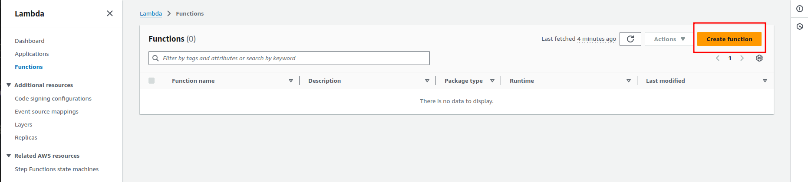
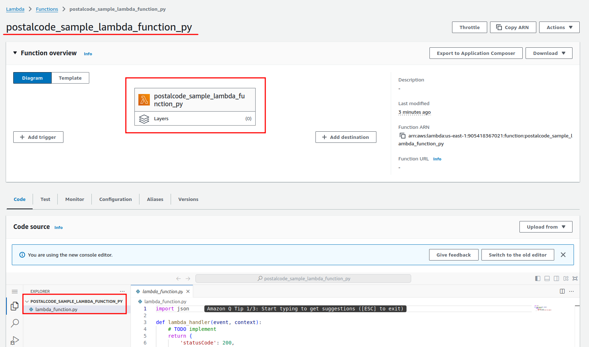
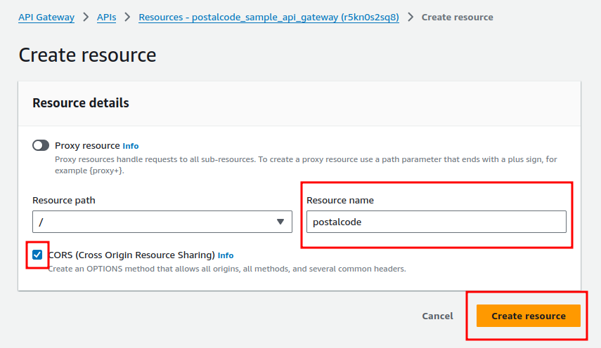
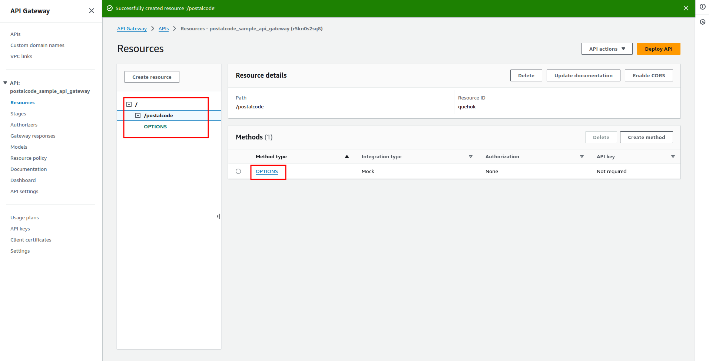
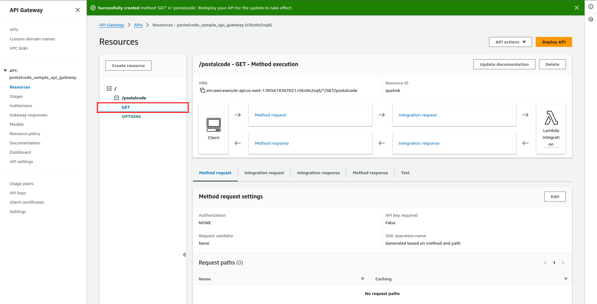
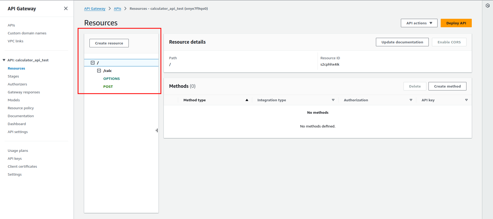

# AWS HELPER
A simple instructions to help developers in overall cases to make configurations int the AWS Services

  

# SUMMARY

- <a href="#IAM">IAM</a>
  - <a href="#Create-a-user-step-by-step">Create a user step by step</a>
- <a href="#BILLING">BILLING</a>
  - <a href="#Manage-Billing-Alarm">Manage Billing Alarm</a>
- <a href="#CLOUD-SHELL">CLOUD-SHELL</a>
- <a href="#AWS-CLI">AWS-CLI</a>
- <a href="#CDK">CDK</a>
- <a href="#SAM-CLI">SAM-CLI</a>
- <a href="#EC2 ">EC2 </a>
  - <a href="#Create">Create</a> 
  - <a href="#Destroy-Instance-EC2">Destroy Instance EC2</a>
- <a href="#AMI-AMAZON-MACHINE-IMAGE">AMI - AMAZON MACHINE IMAGE</a>
- <a href="#S3">S3</a>
  - <a href="#Create-a-default-bucket-to-storage-files">Create a default bucket to storage files</a> 
  - <a href="#Testing-bucket-access">Testing bucket access</a>
  - <a href="#Hosting-Static-Website-Using-ACLs">Hosting Static Website - Using ACLs</a> 
  - <a href="#Hosting-a-website-Using-Bucket-Policy">Hosting a website - Using Bucket Policy</a> 
  - <a href="#Hosting-a-website-Using-friendly-name">Hosting a website - Using friendly name</a>
- <a href="#ROUTE-53">ROUTE 53</a>
  - <a href="#Create-Redirect-to-EC2-Instance">Create Redirect to EC2 Instance</a>
  - <a href="#Create-a-Redirect-to-S3-AWS-Resource">Create a Redirect to S3 AWS Resource</a>
- <a href="#CLOUD-FRONT">CLOUD FRONT</a>
  - <a href="#Create-distribution">Create distribution</a>
  - <a href="#Testing-Distribution">Testing Distribution</a>
  - <a href="#Create-a-new-record-in-the-Route-53">Create a new record in the Route-53</a>
- <a href="#SQS">SQS</a>
  - <a href="#Create-a-queue">Create a queue</a>
  - <a href="#Practical-Example-using-Lambda">Practical Example using Lambda</a>
  - <a href="#Practical-Example-Using-Java">Practical Example Using Java</a>
- <a href="#ECS">ECS</a>
- <a href="#EKS">EKS</a>
- <a href="#RDS">RDS</a>
- <a href="#DYNAMODB">DYNAMODB</a>
- <a href="#API-GATEWAY">API-GATEWAY</a>
- <a href="#LAMBDA-FUNCTIONS">LAMBDA FUNCTIONS</a>
- <a href="#STEP-FUNCTIONS">STEP FUNCTIONS</a>
- <a href="#CLOUD-WATCH">CLOUD WATCH</a>
- <a href="#LOAD-BALANCER">LOAD BALANCER</a>
- <a href="#ACM">ACM</a>
- <a href="#VPC">VPC</a>
- <a href="#ACL">ACL</a>
- <a href="#SECURITY-GROUP">SECURITY GROUP</a>
- <a href="#COSTS-ESTIMATES">COSTS ESTIMATES</a>
- <a href="#AWS-NETWORKING">AWS NETWORKING</a>
- <a href="#S3-ROUTE53-ACM-CLOUD-FRONT">S3 ROUTE53 ACM CLOUD FRONT</a>
- <a href="#API-GATEWAY-AND-LAMBDA">API GATEWAY AND LAMBDA</a>
- <a href="#AWS-LAMBDA-AND-STEP-FUNCTION-THEN-AWS-LAMBDA">AWS LAMBDA AND STEP FUNCTION THEN AWS LAMBDA</a>
- <a href="#AWS-STEP-FUNCTION-AND-AWS-API-GATEWAY">AWS STEP FUNCTION AND AWS API GATEWAY</a>
- <a href="#AWS-STEP-FUNCTION-AND-DYNAMO-DB">AWS STEP FUNCTION AND DYNAMO DB</a>
- <a href="#LOCALSTACK">LOCALSTACK</a>

[//]: # (------------------------------------------------------------------------------------------------------------)

  

## IAM

###### Create a user step by step

- Login in the AWS Console with the administrator account
    - https://aws.amazon.com/
- Go to IAM control panel:
    - https://us-east-1.console.aws.amazon.com/iam/home?region=us-east-2
- Click on the Item Menu on the left side named Users
    - Users
- Specify user details
    - User name
    - Custom password
- Click on Next button
    - Mark Attach policies directly
        - Choose the related permissions
            - AdministrativeAccess (for example)
- Click on Next
- Click on Create user
- Click on Return to users list

Now you will probably visualize the Users list with the last one that was created in this step by step.
So make a logout from the current account and try login using the new user that was created in the steps ago.

[//]: # (------------------------------------------------------------------------------------------------------------)

  

## BILLING

###### Manage Billing Alarm

This setup is important to have a better control in the account costs and avoid surprises in the bills. For that click
on the link https://us-east-1.console.aws.amazon.com/billing/home#/preferences and check the following settings.

- Click on the [Edit] button - Alert preferences
- Mark the checkbox
    - Receive AWS Free Tier alerts
    - Receive CloudWatch billing alerts
- Click on Update

Now go to cloud watching and make the configurations as showed below

> Cloud Watch: https://console.aws.amazon.com/cloudwatch/home

- Click on the link Create alarms
- Click on Create alarm (button)
- Select Region: US East (N. Virginia)us-east-1
- Select metric
- Click on Billing link
- Click on Total Estimated Charge
- Mark the checkbox (Currency: USD)
- Click on Select metric (in the bottom right screen)
- Fill the form
- Choose Next button
- Select Notification Box
    - Fill the form to create a new Topic and inform the email to receive the alarm
- Click on Next
- Give Alarm name
- Click on Next
- Review the Configurations
- Finally, click Create alarm button

> IMPORTANT: Check your email address to Confirm "SNS - Simple Notification Service" and active this resource

[//]: # (------------------------------------------------------------------------------------------------------------)

  

## CLOUD-SHELL

> ABOUT: Access the terminal commands in the AWS Cloud

It is pretty simple and doesn't need more details, just click in the Cloud Shell resource and begin the
administration using a terminal in the browser.

[//]: # (------------------------------------------------------------------------------------------------------------)

  

## AWS-CLI

> NOTE: CLI means Command Line Interface

> To install and configure the amazon aws-cli follow the instructions in the follow page from AWS DOCS
https://docs.aws.amazon.com/cli/latest/userguide/getting-started-install.html

#### Installing

[Linux Installing]

<pre>
curl "https://awscli.amazonaws.com/awscli-exe-linux-x86_64.zip" -o "awscliv2.zip"
unzip awscliv2.zip
sudo ./aws/install
</pre>

[Linux Updating]

<pre>
curl "https://awscli.amazonaws.com/awscli-exe-linux-x86_64.zip" -o "awscliv2.zip"
unzip awscliv2.zip
sudo ./aws/install --bin-dir /usr/local/bin --install-dir /usr/local/aws-cli --update
</pre>

[Check Aws Version]

<pre>
aws --version

aws-cli/2.17.7 Python/3.11.8 Linux/5.15.0-113-generic exe/x86_64.ubuntu.20
</pre>

#### Configuring

[AWS CLI Configuration]

First of all you need to create the AccessKey to configure the aws-cli, then follow the steps below

- Click on the Menu in the top right side of the screen
- Choose Security credentials
- Scroll down "Access key"
    - Click on Create access key button link
    - Choose the Command Line Interface (CLI)
        - Mark the checkbox
    - Click Next
    - Fill the questions in the form ahead
        - Save the generated Access Key and also the Secret access key
    - Click on Done button

- Execute the aws configuration steps

<pre>
aws configure
AWS Access Key ID [None]: AKIA5FTZ........
AWS Secret Access Key [None]: /N+htYqjH9cf68+1...................
Default region name [None]: us-east-1
Default output format [None]: json
</pre>

Now it's possible to execute all commands available for AWS Services, for example:

<pre>
aws s3 ls
aws ec2 describe-instances
</pre>

To get more details see the https://docs.aws.amazon.com/cli/latest/userguide/cli-chap-welcome.html

#### Commands

###### S3
###### SQS
###### LAMBDA
###### VPC
###### EC2
###### ECS
###### EKS
###### ROUTE53
###### RDS
###### DYNAMODB
###### API-GATEWAY
###### ACM
###### ACL

[//]: # (------------------------------------------------------------------------------------------------------------)

  

## CDK

## SAM CLI

## EC2

###### Create

To create an EC2 instance go to EC2 Dashboard and click on the item "Instance" placed at the Menu on the left side 
of the screen, so you will fell down in EC2 Instances manager. 

Now you can follow the steps below to create a new instance.

- Click on "Launch instances" button on the top right of the screen
- Fill the form with the settings like below

<pre>
[Name and tags]

Name: your-instance-ec2-name (temporary-test-ec2)

[Application and OS Images (Amazon Machine Image)]

Select the instance image: Amazon Linux, macOS, Ubuntu, Windows...
Choose the AMI: Amazon Linux 2023
Choose the architecture: 64-bit (x86)

[Instance type]

Choose instance type: t2.micro (for Free tier eligible)

[Key pair]

Create a key pair to SSH connections (don't forget to download and save it)
Click Create key pair (temporary-test-ec2)

[Network settings]

Check VPC
Check Subnet
Check Public IP
Choose the Firewall (security groups)
  Create security group
    Allow SSH traffic from [Anywhere: 0.0.0.0/0] (just for tests)
  Select existing security group
    default or any other one available

[Configure storage]

Add volume if necessary

[Advanced details]

Check the advanced details if necessary

</pre>

Finally, click on "Launch instance" button placed on the bottom right of the screen.
Go back to the EC2 Instance list dashboard and check the instance status that was created in the steps ago.

So now get the Public IP from the instance created and connect via SSH, for example

<pre>
ssh -i "temporary-test-ec2.pem" ec2-user@ec2-54-152-4-44.compute-1.amazonaws.com
</pre>

> NOTE: Don't forget to give correct permissions for the pem file 400

In case the server is disconnecting in a short time you can change the file /etc/ssh/sshd_config to fix it

<pre>
ClientAliveInterval	300
ClientAliveCountMax	3
</pre>

###### Destroy EC2 Instance

> NOTE: It's pretty important to terminate the instance to avoid charges and bills surprised,
> so for that follow the steps below

- Go to your EC2 instance
- Choose 'Instance State'
- Select 'Terminate Instance'
- Check the Instance state: Terminated

[//]: # (------------------------------------------------------------------------------------------------------------)

  

## AMI - AMAZON MACHINE IMAGE

To create an Amazon AMI and use in any EC2 instance follow the steps below:

- Get Access to the target AWS account
- Go to EC2 Instances Dashboard
- Choose the EC2 to create an AMI
- Click on Actions button on the top right of the screen
- Choose Images and Models
    - Create Image or Image Create
- Review the AMI form to make proper configuration
- Choose Create Image

Now you can use this AMI to create others EC2 instances with the same configurations, installations, applications and
features, it can save a lot of time when you need to put the new services or machines online.

- Go to AMI management
- Choose the AMI
- Click right button in the AMI
- Choose Execute Instance in the AMI
- Set up the Instance Details like below

<pre>
[Name and tags]
[Ami]
[Instance type]
[Key pairs]
[Network settings]
    - VPC
    - Allow SSH traffic from: {Anywhere, My IP}
    - Configure the use of SUB-NET
    - Common security groups
[Storage management]
[Advanced Details]
    - Termination Protection ?
    - Shutdown behavior: {Stop, Terminate}
</pre>

- Click on Execute Instance button
- Check if the instance was generated in the EC2 Instances Dashboard

[//]: # (------------------------------------------------------------------------------------------------------------)

  

## S3

#### Create a default bucket to storage files

S3 is a storage service that Amazon offer to storage files, also known as S3 Bucket.
So to create a bucket and connect in it to transfer files for it, follow the topics below

- Access your aws account
- Goto Amazon S3 in this link https://us-east-1.console.aws.amazon.com/s3/get-started?region=us-east-1
- Click on the link Buckets placed on left side of the screen
- Choose Create bucket and fill the information like below

<pre>
[General configuration]
AWS Region: US East (N. Virginia) us-east-1
Bucket type: General purpose
Bucket name: your-domain.com

[Object Ownership]
Select ACLs disabled (recommended)

[Block Public Access settings for this bucket]
Mark the pertinent checkbox to set up the correct access to the bucket
  Block all public access [ ]
    keep this checkbox marked unless you know what you are doing, for example: website hosting, in this case
    we are unmark this checkbox because we will test a single page in the S3 bucket

[Bucket Versioning]
Bucket Versioning: Disable

[Tags - optional (0)]
Let as is

[Default encryption]
Encryption type: Server-side encryption with Amazon S3 managed keys (SSE-S3)
  Bucket Key: Disable

[Advanced settings]
Object Lock: Disable
</pre>

- Choose Create bucket button

Now go back to the Bucket lists in the menu placed on left side of the screen to check if the bucket was created in there.

##### Testing bucket access

If everything is ok, you can upload and download files to the created bucket, and also you can use the sample Java
project to transfer data for the bucket.

This project can be found in the following repository link https://github.com/huntercodexs/help4devs/tree/aws,
you just put the access_key_id and secret_access_key in the application properties file.

<pre>
### S3 Bucket
bucket.name=your-domain.com
cloud.aws.stack.auto=false
cloud.aws.region.static=us-east-1
cloud.aws.credentials.accessKey=AKIA5FTZ.................
cloud.aws.credentials.secretKey=/N+htYqjH9cf68+1fVybO.....................
</pre>

#### Hosting Static Website - Using ACLs

> WARNING: Not recommended

You can host one static website in the S3 bucket as following below.

- Create one specific bucket to host static website:

<pre>
[General configuration]

AWS Region: US East (N. Virginia) us-east-1
Bucket Type: General purpose
Bucket name: your-domain.com

[Object Ownership]

Choose ACLs enabled
Object Ownership
  Choose Object writer
  Unmark "Block Public Access settings for this bucket"
    Mark "I acknowledge that the current settings might result in this bucket and the objects within becoming public."

[Bucket Versioning]
Let as is

Bucket Versioning: Mark Disable

[Tags - optional]
Let as is

[Default encryption]

Encryption type:
  Mark "Server-side encryption with Amazon S3 managed keys (SSE-S3)"
Bucket Key: Disable

[Advanced settings]
Object Lock: Disable
</pre>

- Choose Create bucket

Now you will be redirected automatically to bucket list and probably the bucket it will be listed in that one. 
So now you can click on the your-domain.com to visualize all options to configure this bucket.

- Choose the Upload button at middle of the screen to send the files into the bucket. 
- Select the files to upload
- After file uploaded, just click on Upload button placed at the bottom screen
- Also, you can upload one entirely folder that contains a website content
- Go to the bucket files list and choose the Properties Tab
- Scroll down until "Static website hosting" and click on Edit
- Mark "Static website hosting" as Enable
- Identify the index document
  - Index document: index.html
- Finally, click on Save changes
- Check and take note the URL created to access the static website (at the bottom of screen)
  - http://your-domain.com.s3-website-us-east-1.amazonaws.com

If you try to access the website right now, probably you will receive an HTTP error "403 Forbidden", because 
still need to make a few others changes in that bucket, so lets moving on.

- Scroll down until "Object Ownership" iIn the "Permissions Tab"
- Click on Edit
- Ensure that the "Bucket owner preferred" is marked
- Go back to "Objects Tab" select the files and folders
- Click on Actions menu
- Choose "Making public using ACL"
- Choose Make public button
- Click on OK button

Since for now, if everything was configured correctly you will be able to access the application website from 
the URL mentioned a few steps earlier, just for example:

> http://your-domain.com.s3-website-us-east-1.amazonaws.com

> NOTE: We don't have a DNS in this situation

#### Hosting a website - Using Bucket Policy

In this case we will use a complete environment to publish a static website with TLS and specific domain 
name, sSo let's get started and hands on.

> NOTE: In this case we will use the huntercodexs domain to create all configurations, so keep in your 
> mind that you should be changed this information for your current needed.

- Click on Create bucket button to create one specific bucket to host static website:
- Fill the form as follows

<pre>
[General configuration]

AWS Region: US East (N. Virginia) us-east-1
Bucket Type: General purpose
Bucket name: huntercodexs.com

[Object Ownership]

Choose "ACLs disabled (recommended)"
Block Public Access settings for this bucket
  Mark "Block all public access"

[Bucket Versioning]

Bucket Versioning:
  Mark Disable

[Tags optional]
> Let as is

[Default encryption]

Encryption type: Mark "Server-side encryption with Amazon S3 managed keys (SSE-S3)"
Bucket Key: Enable

[Advanced settings]

Object Lock: Disable
</pre>

- Choose Create bucket

Now you will be redirected automatically to the bucket list and probably the created bucket it will be 
listed in that one. So now, you can click on the huntercodexs.com to visualize all options and configure 
this bucket.

- Choose the Upload button at middle of the screen to send the files into the bucket.
- Upload files
- Click on Upload button 
- Go to S3 bucket details
- Click "Properties Tab"
  - Check if "Static website hosting" is Disabled
- Now click on "Permissions Tab"
  - Check if "Block public access (bucket settings)" is on
  - Click on Edit
  - Unmark the item "Block all public access"
    - Click on Save changes
      - Put confirm in the input text box
      - Click on Confirm button
  - Now the "Block public access (bucket settings)" is off
  - Still in the "Permissions Tab" scroll down until "Bucket policy" and click on Edit
    - Add the following policy

> IMPORTANT: Change the Resource field to your current Bucket ARN

<pre>
{
    "Version": "2012-10-17",
    "Id": "Policy1720049315656",
    "Statement": [
        {
            "Sid": "AllowPublicRead",
            "Effect": "Allow",
            "Principal": "*",
            "Action": "s3:GetObject",
            "Resource": "arn:aws:s3:::huntercodexs.com/*"
        }
    ]
}
</pre>

- Scroll down at the bottom of the page and click on Save changes
- Now go to "Properties Tab" and scroll down until "Static website hosting"
- Click on Edit
  - Mark Enable to "Static website hosting"
  - In "Hosting type" mark "Host a static website"
  - Give an index document name: index.html
  - Choose Save changes
- Still in the "Properties Tab" scroll down again until "Static website hosting" and get the URL generated
  - Example: http://huntercodexs.com.s3-website-us-east-1.amazonaws.com
  - If everything is ok, so you probably will receive the index.html page in your browser, do try it.

#### Hosting a website - Using friendly name

> NOTE: This step requires an DNS previously registered and activated in any DNS service provider, for more details 
> see the section Route-53 along this documentation

Since now, we are going to create a more friendly name to our static website because the current name that should 
be something like that huntercodexs.com.s3-website-us-east-1.amazonaws.com, and it is very confusing, 
stranger and hard to understand and memorize, and for that we will use the Route-53 from AWS Services, so let's go.

- Get access into Route-53
- Check the Region and Zone (normally in this case ís a Global)
- Look up for "Hosted zones" on the left side at the screen 
- Click on "Create hosted zone" button
- Fill the form with the following information

<pre>
Domain name: huntercodexs.com
Description (optional): 
Type: Public hosted zone
Tags:
</pre>

- Click on Create hosted zone

> IMPORTANT: Don't forget to configure your DNS service provider with the NS name services available in the hosted
> zone that you just have created, this information can be grabbed in the "Hosted zone details"

- Now you will be probably redirected to huntercodexs.com hosted zone, where you will see one list of records to 
routes and DNS configurations, so for now click on Create record and follow the steps below

<pre>
Record name: (huntercodexs.com)
Record type: A - Routes traffic to an IPv4 address and some AWS resoruces
Alias: Marked
Route traffic to: 
  - Alias to S3 website endpoint
  - US East (N. Virginia)
  - s3-website-us-east-1.amazonaws.com
Routing policy: Simple routing
</pre>

- Click on Create records button
- Now, create another two record like below

<pre>
Record name: site (huntercodexs.com)
Record type: CNAME – routes traffic to another domain name and to some AWS resources
Value: huntercodexs.com
TTL(seconds): 300
Routing policy: Simple routing
</pre>

<pre>
Record name: www (www.huntercodexs.com)
Record type: CNAME – routes traffic to another domain name and to some AWS resources
Value: huntercodexs.com
TTL(seconds): 300
Routing policy: Simple routing
</pre>

- Click on Create records button

- Now, access the static website using the new name: 
  - http://huntercodexs.com
  - http://huntercodexs.com
  - http://www.huntercodexs.com

> NOTE: This can take a several times to be activated by your DNS service provider

- The image below show the Route53 configured and running

[//]: # (------------------------------------------------------------------------------------------------------------)

  

## ROUTE 53

#### Create Redirect to EC2 Instance

To get start the Route 53 configuration have in hand the following information

> NOTE: All information about one specific hosted zone can be obtained at section "Hosted zone details" in the 
> proper hosted zone at top of that

<pre>
    #DNS na AWS
    ns-1234.awsdns-00.org
    ns-1234.awsdns-00.co.uk
    ns-1234.awsdns-00.com
    ns-1234.awsdns-00.net

    #DNS in the domain server
    ns1.dns-parking.com
</pre>

- In the AWS manager console seek by Route 53 and click in it.

- If you have a hosted zone on Route 53, click on the "Hosted zone" link to access the options for
  zone management, and on this screen it is possible to create a new zone or edit an existing one. 

- You, too, can use the menu on the left side of the "Hosted Zones" screen to access this screen.

- Both in the previous case and in the case of being the first zone to be created, click on the "Create hosted zone" button.

- On the zone creation screen, enter the domain name, comment and type (public).

- When clicking on Create you will be directed to the created zone/domain screen, where you can carry out the
  settings necessary to activate routing for it.

- Click on Create record to be directed to the configuration screen for the record/domain to be routed.

- Fill in the registration name, choose the type of registration, in value enter the IP (or Elastic IP) of the machine
  which is in the cloud on AWS, TTL and Routing Policy, for example:

<pre>
Registration name: your-domain.com or www.your-domain.com
Record Type: A – Routes traffic to an IPv4 address and some AWS resources
Value: 54.51.92.190 (Elastic IP)
TTL: 300 (seconds)
Routing policy: Simple routing
</pre>

<pre>
Registration name: your-domino.com or www.your-domain.com
Record type: CNAME – routes traffic to another domain name and to some AWS resources
Value: your-domain.com
TTL: 300 (seconds)
Routing policy: Simple routing
</pre>

- Obtain DNS data from AWS to insert into your hosting or registry server, for example:
<pre>
ns-1234.awsdns-00.org
ns-1234.awsdns-00.co.uk
ns-1234.awsdns-00.com
ns-1234.awsdns-00.net
</pre>

- Go to your hosting or registration service, DNS management panel and enter one by one the DNS entered by AWS.

> NOTE: You may need to wait a few moments for the redirection and feature activation to take effect.

#### Create a Redirect to S3 AWS Resource

- Access the AWS Account
- Go to Route-53 service
- Look for Hosted zones
- Click on Create hosted zone button
- In the form to create a hosted zone
  - Domain name: you-domain.com
  - Description(optional): Desc....
  - Type: Public hosted zone
  - Tags: ...
  - Click on Created hosted zone
- Now go back to Hosted zone list, you will probably see the hosted zone created in that list
- Click on the hosted zone that you just have created link
- Now, if everything was made correctly, you should be able to see the NS Servers available for your account/domain, 
for example:

<pre>
ns-1234.awsdns-00.org
ns-1234.awsdns-00.co.uk
ns-1234.awsdns-00.com
ns-1234.awsdns-00.net
</pre>

- Note that the expected type for the correct record must be "NS
- Now, go to your service provider DNS in the web
- Put the DNS servers from AWS in the DNS Servers in the proper section in your current service provider
- Click on Save to activate the changes

> NOTE: To do that you need to have an account and domain registered in any register domain service, for example:
> GoDaddy, UOL, Hostinger, Alligator among others. So go to in the section DSM/Nameservers from your current
> service provider and get the DNS Servers that are affordable in there.

- Go back to Route-53 in your AWS account
- Click on the target hosted zone link to edit it
- Click on Create record button to create the first record, and follow the information below:

<pre>
Registration name: www (www.your-domain.com)
Record type: CNAME – routes traffic to another domain name and to some AWS resources
Value: http://your-domain.com
TTL: 300 (seconds)
Routing policy: Simple routing
</pre>

- Click on Save button, and that's it
- Now, let's go created a second record in the hosted zone
- Click on Create record again in the same hosted zone, and follow the information below:

<pre>
Registration name: s3 (s3.your-domain.com)
Record type: CNAME – routes traffic to another domain name and to some AWS resources
Value: s3.your-domain.com.amazon-aws-bucket
TTL: 300 (seconds)
Routing policy: Simple routing
</pre>

- Choose Create records button
- Test the access using your web browser

> NOTE: You may need to wait a few moments for the redirection and feature activation to take effect.

[//]: # (------------------------------------------------------------------------------------------------------------)

  

## CLOUD FRONT

#### Create distribution

Below is how to create a sample distribution in the Cloud Front.
Follow these steps to delivery a content successfully. 

- Origin

<pre>
Origin domain: help4devs.com.s3.us-east-1.amazonaws.com
### Do not choose the "Use website endpoint"
Origin path - optional: 
Name: help4devs.com.s3.us-east-1.amazonaws.com
Origin access: Public
Add custom header - optional: 
Enable Origin Shield: No
</pre>

- Default cache behavior

<pre>
Path pattern: Default (*)
Compress objects automatically: Yes
</pre>

Viewer

<pre>
Viewer protocol policy: Redirect HTTP to HTTPS
Allowed HTTP methods: GET, HEAD
Restrict viewer access: No
</pre>

Cache key and origin requests

<pre>
Cache policy and origin request policy (recommended): Marked
Response headers policy - optional:
</pre>

- Function associations - optional

<pre>
Viewer request: No association
Viewer response: No association
Origin request: No association
Origin response: No association
</pre>

- Web Application Firewall (WAF)

<pre>
Do not enable security protections: Marked
</pre>

- Settings

<pre>
Price class: Use all edge locations (best performance)
Alternate domain name (CNAME) - optional: help4devs.com
Custom SSL certificate - optional: Custom SSL certificate - optional (17761472-a01d-422e-9fdf-5e6c14a0f558)
Security Policy: TLSv1.2_2021 (recommended)
Supported HTTP versions: HTTP/2
Default root object - optional: index.html
Standard logging: Off
IPv6: On
Description - optional: website help4devs
</pre>

#### Testing Distribution

- You can test the access using the "Distribution domain name" placed in the "General Tab" inside the current 
"Cloud Front Distributed" that you just have created, for example:

<pre>
https://dijdcwprgmu5e.cloudfront.net
</pre>

#### Create a new record in the Route-53

- In the Route-53 look up for the target hosted zone and click on it
- Now, create a new record clicking on Create record button
- Fill the form as follows

<pre>
Record name: (help4devs.com)
Record type: A - Routes traffic to an IPv4 address and some AWS resources
Alias: Marked
Route traffic to: Alias to Cloud Front distribution
Region: US East (N. Virginia)
Distribution: (help4dev.com) dijdcwprgmu5e.cloudfront.net
Routing policy: Simple routing
</pre>

- Choose Create record button
- Testing your cloud front application access via HTTP/HTTPS, for example:
  - http://help4devs.com (should be redirected to HTTPS automatically)
  - https://help4devs.com

[//]: # (------------------------------------------------------------------------------------------------------------)

  

## SQS

#### Create a queue

To create a simple queue in the SQS service at Amazon AWS services follow the steps below.

- Goto SQS dashboard
- Click on Queues at the menu on the left side of the screen
- Click on Create queue button
- Fill the form as follows

<pre>
[Details]
Type: (Standard | FIFO) ## You can change it later if necessary
Name: queue-name-test (Standard) | queue-name-test.fifo (FIFO)

[Configuration]
Visibility timeout: 30 (seconds) ## This means how long time the message should be visible
Message retention period: 4 days
Delivery delay: 0 seconds
Maximum message size: 256KB
Receive message wait time: 0 seconds

[Encryption]
Server-side encryption: Enabled
Encryption key type: Amazon SQS key (SSE-SQS)

[Access policy]
Choose method: Basic
Define who can send messages to the queue: Only the queue owner
Define who can receive messages from the queue: Only the queue owner

[Redrive allow policy]
Select which source queues can use this queue as the dead-letter queue.: Disabled

[Dead-letter queue]
Set this queue to receive undeliverable messages: Disabled

[Tags - Optional]
let as is
</pre>

- Click on Create queue

Now, you probably will be redirected to queue details page, so look up for "Send and receive messages" button and 
click on it to test the message send. At this moment we have two box in the screen, Send message and Receive messages, 
so now put one text message in the input text and click on Send message button on the top right of the page.

When you click on the Send message button, you must be able to see the change in the Messages available in the 
"Receive messages" in the second box at the screen. This means that there is one message awaiting consumer to get and 
process that message.

Once the message is captured/read by the consumer, it has 30 seconds to process the message until the message go back 
for the queue and stay available again for another consumers. You can click on the "Poll for messages" button to 
download/get the messages that are in the queue.

Below is one image that shown all this process

Still talking about the queue edit functionality, it is possible to purge the queue using a button placed in the queue 
details, but in this case be carefully because this procedure will be removing all messages from the queue.

Finally, if you need to create one queue that avoid duplication message, so you need to choose the FIFO type to enable 
the deduplication functionality, below follow one simple configuration to apply in this situation.

How can see in the above image, the Type FIFO has enabled one more option in the Configuration section, witch offer 
flags and settings to avoid duplication in the queue.

In the FIFO queues all duplicated message will be ignored automatically to avoid duplication in the process, because
the queue configuration is enabled to queue and not for group ID. 

When we need to guarantee the unique message separated by group ID, we need to make one configuration like below

But it is very important to know that the message should be grouped by one "Message group ID", for example: payment, sales, stock, 
blocked, dispatch, etc...

Above we can see four message that have the same content

<pre>
{"id": 1, "amount": 100, "message": "ok"}
</pre>

but the "Message group ID" for each one is different, we have: payment, sales, purchase and dispatch. This detail 
can be found in the message clicking on the link message and going to "Details Tab" at the same message.

#### Practical Example using Lambda

In this topic we will create a sample integration between SQS and LAMBDA functions, and to do that the following 
steps need to be done.

- Goto SQS dashboard and lookup for Queues
- Click on Create queue button
- Fill the form as follows

<pre>
[Details]
Type: FIFO
Name: queue-test.fifo

[Configuration]
Visibility timeout: 30 (seconds) ## This means how long time the message should be visible
Message retention period: 4 days
Delivery delay: 0 seconds
Maximum message size: 256KB
Receive message wait time: 0 seconds

[FIFO queue settings] ## This configuration avoid deduplication in the Message group
Content-based deduplication: Mark
High throughput FIFO queue (recommended): Mark

[Encryption]
Server-side encryption: Enabled
Encryption key type: Amazon SQS key (SSE-SQS)

[Access policy]
Choose method: Basic
Define who can send messages to the queue: Only the queue owner
Define who can receive messages from the queue: Only the queue owner

[Redrive allow policy]
Select which source queues can use this queue as the dead-letter queue.: Disabled

[Dead-letter queue]
Set this queue to receive undeliverable messages: Disabled

[Tags - Optional]
let as is
</pre>

- Click on Create queue button

Now, we need to create the integration with Lambda function, so fow now go further in the steps below

- Goto AWS Lambda resources
- Click on Create function button and fill the form as follows

<pre>
[Create function]
Choose one type of lambda function: 
  Author from scratch: Marked
  Use a blueprint
  Container image

[Basic information]

Function name: lambda-function-test
Runtime: Python 3.9
Architecture: x86_64

[Permissions]
let as is

Change default execution role: Create a new role with basic Lambda permissions

[Advanced settings]
let as is
</pre>

- Choose Create function button

You must be able to see the "Code source" section ready to code including one sample Python 3.9 code, for example:

For now, just click on Deploy button according showed the above image, and make one more configuration but in that 
time using the "Configuration Tab" from the target lambda function.

- Click on Permissions item in the menu on the left side of the screen
- Now click on the link named "Role name" lambda-function-test-role-8tjqcqvx

You will be redirected to IAM dashboard manager, so go ahead and make the required changes in the SQS role

- In the Permissions policies click on "Add permissions" button and select "Attach policies"

- Type "sqs" in the input text to filter the permissions policies according as image below

- Choose the "AWSLambdaSQSQueueExecutionRole"
- Click on "Add permissions" button at the same screen

The resource policy should be something like below

<pre>
{
    "Version": "2012-10-17",
    "Statement": [
        {
            "Effect": "Allow",
            "Action": [
                "sqs:ReceiveMessage",
                "sqs:DeleteMessage",
                "sqs:GetQueueAttributes",
                "logs:CreateLogGroup",
                "logs:CreateLogStream",
                "logs:PutLogEvents"
            ],
            "Resource": "*"
        }
    ]
}
</pre>

OK, now lets go back for SQS dashboard and get access to the target queue.

- Click on "Configure Lambda function trigger" button
- In the field "Specify an AWS Lambda function available for this queue.", choose the lambda function created above
- Click on Save
- OK, the SQS queue is done
- Now go back to target lambda function and get access the "Code Tab"

Check this code

<pre>
import json

def lambda_handler(event, context):
    print(event)
    for record in event.get('Records'):
        body = json.loads(record.get('body'))
        id = body.get('id')
        name = body.get('name')
        print(f'Id: {id}, Name: {name}')
        return {
            'statusCode': 200,
            'body': json.dumps('Hello from Lambda!')
        }
</pre>

The code below belong to the lambda function just created and have the unique and simple responsibility to print the 
event from SQS queue services because web have had configured the SQS to use this lambda function.

- So, go to SQS queue target again
- Click on "Send and receive messages" button
- Fill the form with related information and click on Send message

[Message]

<pre>
Message body: {"id":1, "name": "John Smith"}
Message group ID: payment
</pre>

- If everything was fine, goto Cloud Watch to check if the messages were processed correctly
- Choose Logs->Log group->Log stream
- The result should be something like that

#### Practical Example Using Java

...

[//]: # (------------------------------------------------------------------------------------------------------------)

  

## ECS

[//]: # (------------------------------------------------------------------------------------------------------------)

  

## EKS

[//]: # (------------------------------------------------------------------------------------------------------------)

  

## RDS

[//]: # (------------------------------------------------------------------------------------------------------------)

  

## DYNAMODB

[//]: # (------------------------------------------------------------------------------------------------------------)

  

## LAMBDA FUNCTIONS

#### PYTHON 

To create a python lambda function in the aws services follow the steps below.

- Get access in your aws account
- Goto Lambda functions dashboard
- Lookup for functions on the left menu of the screen
- Click on Create function button
- Fill the form as follows

<pre>
[Create function]
Choose one type of lambda function: 
  Author from scratch
  Use a blueprint
  Container image

[Basic information]

Function name: hello-world-lambda-function-py
Runtime: Python 3.12
Architecture: x86_64

[Permissions]
let as is

Change default execution role: Create a new role with basic Lambda permissions

[Advanced settings]
let as is
</pre>

- Click on Create function

You will be redirected for the panel of the lambda function just created, so now you must be able to see one section 
that means "Code source"

<pre>
import json

def lambda_handler(event, context):
    print "Running lambda_handler..."
</pre>

After created the function and code correctly, go further in the steps below

- Click on Deploy button
- Click on Test button

The result should be something like below

In this point, you can click in the "Monitor Tab" showed in the above image and click on "View CloudWatch logs" 
to get access to the AWS CloudWatch service and see the logs generated by this simple function.

Below in an image that describe this situation

If you click on some link related to logs it will be detailed the log process that this functions has been generated, 
and should be like something below

It is possible to see in the above image the message produced by the current lambda function testing here

- Example Lambda Function in Python

<pre>
import http.client
import json

def lambda_handler(event, context):
    

    code = event['postalcode'];
    conn = http.client.HTTPSConnection('viacep.com.br')
    headers = {'Content-type': 'application/json'}

    conn.request('GET', '/ws/'+code+'/json/', 'null', headers)
    response = json.loads(conn.getresponse().read().decode())

    return response
</pre>

#### JAVA

To create a java lambda function in the aws services follow the steps below.

- Get access in your aws account
- Goto Lambda functions dashboard
- Lookup for functions on the left menu of the screen
- Click on Create function button
- Fill the form as follows

<pre>
[Create function]
Choose one type of lambda function: 
  Author from scratch
  Use a blueprint
  Container image

[Basic information]

Function name: hello-world-lambda-function-java
Runtime: Java 17
Architecture: x86_64

[Permissions]
let as is

Change default execution role: Create a new role with basic Lambda permissions

[Advanced settings]
Enabled function URL: Marked
Auth type: NONE
Invoke mode: BUFFERED (default) 
</pre>

- Click on Create function

You will be redirected for the panel of the lambda function just created, so now you must be able to see one section
that means "Code source". In this case, when we are using Java Runtime, the IDE code is not available, so we need to 
follow another way to get everything done.

Follow the steps below to put Java application running in the lambda function.

> Please use the sample project placed in the link: https://github.com/huntercodexs/help4devs-aws

- Clone the repository from https://github.com/huntercodexs/help4devs-aws
- Open the project from the repository in the IDE IntelliJ
- Check the pom.xml file and the README from that repository
- Go to Maven Tab in the IDE
- Lookup for Maven commands and run the maven package or maven install
- Get the jar file generated in this step
- Now, go back to AWS Lambda services and get access in the target lambda function
- Go to "Code source" section and click on "Upload from" button on the right of the section
- Choose .zip or .jar file and select the target jar file
- After that wait the upload complete
- Since the jar file was send successfully click on the "Test Tab"
- Fill the form to make a test

<pre>
[Test event]

Test event action: Create new event
Event name: test-event
Event sharing settings: Private
Template - optional: Choose the related template
</pre>

- Click on Test button above the current section

> NOTE: In this case you also can see the log process at the Cloud Watch in the "Logs->Log groups"

Finally, it's possible to make a test using a more convenient way using Function URL, so follow the steps below if 
you desire to do that

- Click on "Configuration Tab" in the current lambda function
- Click on the "Function URL" on the left menu of the screen
- You must be able to see the URL from the section "Function URL", something like below

> https://fxwsvhqmdksobfcmov3extc6tm0kzngq.lambda-url.us-east-1.on.aws/

- Get this URL and make a test using any HTTP client, for example: POSTMAN, INSOMNIA, etc.

[Example]

REQUEST
<pre>
POST https://fxwsvhqmdksobfcmov3extc6tm0kzngq.lambda-url.us-east-1.on.aws/
</pre>

RESPONSE
<pre>
{
  "result": true
}
</pre>

[//]: # (------------------------------------------------------------------------------------------------------------)

  

## API-GATEWAY

[//]: # (------------------------------------------------------------------------------------------------------------)

  

## STEP FUNCTIONS

[//]: # (------------------------------------------------------------------------------------------------------------)

  

## CLOUD WATCH

The Cloud Watch is a complete dashboard to give support an analysis of the events, metrics, crash, and 
others things relate to that. Below is the short explanations about the resources offered in the AWS resource.

#### Alarms
#### Logs
#### Metrics
#### X-Ray-traces
#### Events
#### Application Signals
#### Networking monitoring
#### Insights

[//]: # (------------------------------------------------------------------------------------------------------------)

  

## LOAD BALANCER

[//]: # (------------------------------------------------------------------------------------------------------------)

  

## ACM

[//]: # (------------------------------------------------------------------------------------------------------------)

  

## VPC

[//]: # (------------------------------------------------------------------------------------------------------------)

  

## ACL

[//]: # (------------------------------------------------------------------------------------------------------------)

  

## SECURITY GROUP

[//]: # (------------------------------------------------------------------------------------------------------------)

  

## COSTS ESTIMATES

[//]: # (------------------------------------------------------------------------------------------------------------)

  

## S3 ROUTE53 ACM CLOUD-FRONT

In this topic we will host a static website in the Amazon Web Services using S3 Bucket + Route53 + ACM + CLOUD-FRONT. 
To do that, it's required that you have previously registered one domain name service in any DNS services provider 
like Godaddy, Hostinger, Hostigator, among others.

So in this, just for clarify and explain everything in a better way, we are going to use the help4devs.com domain, 
that is a product from huntercodexs.com witch is maintained by jereelton-devel (witch have written this 
documentation), so lets get started and hands on.

First of all you need to keep in your mind the following considerations:

- The name of the domain is: help4devs.com
- The name of the S3 bucket it will be the same: help4dev.com
- The hosted zone in the Route53 it will be the same as well: help4devs.com
- The distribution in the Cloud Front also should be: help4devs.com
- Finally, the Certificate should be requested for: help4devs.com and www.help4fevs.com

> IMPORTANT: It is very important to check if your application can handle the browser cache, and 
> probably you will need to clear the cache in the web browser to get the expected result.

> NOTE: The website must be a static website commonly using HTML, CSS, and JS, so ensure that 
> the project web to deploy in this scenario follows this specification.

Once it defined and well clearly those things, lets moving on for the start procedures.

#### S3 - Bucket creation

- Goto S3 Bucket in the AWS services
- Click on Create bucket button
- Fill the form as follows

<pre>
[General configuration]
AWS Region: US East (N. Virginia) us-east-1
Bucket type: General purpose
Bucket name: help4devs.com

[Object Ownership]
Select ACLs disabled (recommended)

[Block Public Access settings for this bucket]
Block all public access: Unmark
  Mark the checkbox alert to advice about public access
  [x] I acknowledge that the current settings might result in this bucket and the objects within becoming public.

[Bucket Versioning]
Bucket Versioning: Disable

[Tags - optional (0)]
Let as is

[Default encryption]
Encryption type: Server-side encryption with Amazon S3 managed keys (SSE-S3)
  Bucket Key: Disable

[Advanced settings]
Object Lock: Disable
</pre>

- Click on Create bucket

Now you will be redirected to bucket list, and you must be able to see the bucket that you just have created 
in this process, so click in the bucket created and go further with the steps.

- Click on the Upload button to send the static files to the bucket
- Afterward you will see the files in the "Object Tab" inside the bucket

- Click on the "Properties Tab"
- Scroll down until "Static website hosting" and click on Edit
- Fill the form as follows

<pre>
[Static website hosting]

Static website hosting: Enable
Hosting type: Host a static website
Index document: index.html
Error document-optional:
Redirection rules – optional: 
</pre>

- Click on Save changes
- Scroll down again until "Static website hosting" and check if the result is something like below

See that there is one default url generated by AWS witch can be used to access your static website in the web browser

- Now, goto "Permissions Tab"
- Scroll down until Bucket policy and click on Edit button
- You can use the "AWS Policy Generator" to make it
- The rule should be something like that

<pre>
{
	"Version": "2012-10-17",
	"Id": "Policy1720231682330",
	"Statement": [
		{
			"Sid": "Stmt1720231676574",
			"Effect": "Allow",
			"Principal": "*",
			"Action": "s3:GetObject",
			"Resource": "arn:aws:s3:::help4devs.com/*"
		}
	]
}
</pre>

> IMPORTANT: replace Resource field by yor current resource "arn:aws:s3:::help4devs.com/*" and don't forget to use
> / * at the end of the string

So now you can test if the bucket is available to access via browser using the url generated by AWS in the previous step.

#### Route 53 - Hosted Zone creation

- Get access to your AWS account and goto Route53 dashboard
- Click on Hosted zone on the left menu at the screen
- Choose the Created hosted zone button
- Fill the forms as follows

<pre>
[Hosted zone configuration]

Domain name: help4devs.com
Description - optional: Website Help4Devs (Godaddy)
Type: Public hosted zone

[Tags]
let as is
</pre>

- Click on Created hosted zone

You will be redirected to hosted zone list automatically, and you should be able to see the hosted zone that was 
just created in the hosted zone list, so for now click on it according the image below

At this moment, you will see something like below

Now, you need to get the NS Servers identification and put on the correct place in your DNS service provider to 
activate the redirecting for you domain into Route 53 AWS service, this step it is so important.

- After that, you can move on for the next step, request a certificate.

#### ACM - Certificate request

Once you have created a hosted zone and one static website, follow these steps below to get the SSL certificate 
generate by Amazon Web Services.

- Go to the ACM (Amazon Certificate Manager)
- Look up for List certificates and click on it
- Now, click on Request button to start a request certificate
- Follow the instructions as follows

<pre>
[Certificate type]

Request a public certificate: Marked
Domain names: help4devs.com
### You can add more than one domain name, for example: www.help4devs.com, site.help4devs.com, and etc...

[Validation method]

DNS validation - recommended: Marked

[Key algorithm]

RSA 2048: Marked

[Tags]

Use as is
</pre>

- Click on Request button (at the bottom of the page)
- Now, you need to await for finished process to request certificate
- The List certificate dashboard should be like below

- Click on the link (guid marked in orange box in the above image) to access the certificate details
- Scroll down until Domains and click on "Create records in Route 53" as showed below

> NOTE: Also, you can see that there is one orange box to give a highlight in the domains that were 
> registered in the current SSL certificate request, help4dev.com and www.help4devs.com

- In the next screen you just have to click on Create records, this action it will create the inputs in the Route53
in the current domain help4devs.com. These inputs are related to SSL certificate and will be turning the HTTPS 
available for the current domain.
- OK, for now the ACM is successfully completed, and you just need to await  for the certificate approved by Amazon to
go further in the configuration

#### CLOUD-FRONT - Distribution creation

If all previous steps are been made successfully, you can distribute the static website using CloudFront, so for
that just follow the steps ahead and everything will work fine.

- Go to Cloud Front from AWS services
- Click on Distributions link on the menu on the left side of the screen
- Click on Create distribution button at the top right of the screen
- Fill the form as follows

<pre>
[Origin]

## When you click in that one, a options it will be shown automatically based on S3 bucket static website
Origin domain: help4devs.com.s3.us-east-1.amazonaws.com
## Don't click on "Use website endpoint", just go ahead
Origin path - optional:
Name: help4devs.com.s3.us-east-1.amazonaws.com
Origin access: Public
Add custom header - optional: 
Enable Origin Shield: No

[Default cache behavior]

Path pattern: Default (*)
Compress objects automatically: Yes

[Viewer]

Viewer protocol policy: Redirect HTTP to HTTPS
Allowed HTTP methods: GET, HEAD
Restrict viewer access: No

[Cache key and origin requests]
Cache policy and origin request policy (recommended): Marked
Response headers policy - optional: 

[Function associations - optional]
Ignore this step

[Web Application Firewall (WAF)]

Do not enable security protections: Marked

[Settings]

Price class: Use all edge locations (best performance)
Alternate domain name (CNAME) - optional: help4devs.com
Custom SSL certificate - optional: help4devs.com (17761472-a01d-422e-9fdf-5e6c14a0f558)
TLSv1.2_2021 (recommended): Marked
Supported HTTP versions: HTTP/2
Standard logging: Off
IPv6: On
</pre>

- Click on Create distribution

Now, you need to await for the complete deploying to activate the delivery, you can do it checking the status in the 
list of distribution from Cloud Front, as showed below

If the status is Enabled and Last modified is not null, so you have a sure that everything is done, so for now click 
on distribution link "E2YCFFG62C0DNC" according showed in the above image to get more details about it.

In the "General Tab" there is one box named Details with one field defined as "Distribution domain name" witch have 
a small bullet next to, so click on it and get the url, for example: https://dijdcwprgmu5e.cloudfront.net. Look that 
it is a HTTPS url, i.e. it will be request a safety connection guaranteed by Amazon Certificate Manager

#### Create Route to friendly URL

In the above image we can see a complete hosted zone configured to work correctly, there is one record of A type, and 
two records CNAME typed, these two CNAME records are related to our certificate that were created when we clicked on 
the "Create records in Route 53" previously in this topic.

Now, talking about the first one present in this hosted zone, it was created to redirect all HTTP/HTTPS requests for 
our CloudFront distribution, and this was made according the steps below

- Click on Create record
- Fill the form as showed in the image below

- Just click on Create records button to finish everything

Now you can access the static website using HTTPS and one friendly URL, for example: https://help4devs.com

[//]: # (------------------------------------------------------------------------------------------------------------)

  

## API-GATEWAY-AND-LAMBDA

#### LAMBDA FUNCTION CREATE

To create a lambda function, follow the instructions below, in this example we will use python as a 
programming language.

- Goto the dashboard Lambda and click on Create function button
 

- Fill the form Create function according something like below

After fill the form to create a function, click on Create function button. The result should be like the illustration
below, can have some differences in your case of course.

Now goto the Code source tab and put the following code inside the code editor

<pre>
import http.client
import json

def lambda_handler(event, context):
    

    code = event['postalcode'];
    conn = http.client.HTTPSConnection('viacep.com.br')
    headers = {'Content-type': 'application/json'}

    conn.request('GET', '/ws/'+code+'/json/', 'null', headers)
    response = json.loads(conn.getresponse().read().decode())

    return response
</pre>

The result should be something like that

After put the code in the code editor, click on the Deploy button to apply all changes in the current lambda function.
You can make a test to guarantee that everything is ok, for that just click on the Test tab above the code editor, 
fill the form and click on Test button, the result should be something like below:

In this point everything is ok with the lambda function and ready to run.

#### API GATEWAY CREATE

##### Using HTTP Method GET

- Goto API GATEWAY Dashboard and choose Build from REST API option, according image below:

- Fill the Create REST API form

At this moment you will be redirected to the Api Gateway (Resources) dashboard, where you will see some options 
according the illustration below:

Now we will create the resources and HTTP Methods to serve our API by these endpoints, so for that make the following 
operations inside the Resources panel.

- Click on Create resource button in the Resources panel
- Let Proxy resource check deactivated
- In the Resource path field let "/"
- In the Resource name give the name: postalcode
- Check the CORS options (to prevent unexpected behaviour to the request /{code}/, /{code})
- Click on Create resource button

The image below shows how to do it

You will be redirected to the Resources panel automatically and probably will see something like below in the panel

Realize that there is the resource /postalcode created and below of that another field named OPTIONS, that offers 
a control in the headers of requests, given a way to configure the Authorization and things related to the headers. 

To go further, select the resource /postalcode and click on Create method button on the right side of the dashboard.

- Choose GET for the Method type
- Choose Lambda function for the Integration type
- Choose the region and the Lambda function previously created named postalcode_sample_lambda_function_py
- Click on Create method button

These steps are illustrated in the image below

At this moment you probably will be able to see the dashboard configured according something like below

Finally, it is pretty important to make one last thing, create the models mapping, and for that you should select 
the resource GET, click on the "Integration request", and then click on "Edit" button. One new form will e open 
called "Edit integration request", so in that form scroll down until "Mapping templates" and click on 
"Add mapping template" to write the following information:

- In the Content type put the "application/json" text
- And finally, and the most important write in the "Template body" the following text:

<pre>
{
   "postalcode": "$input.params('code')"
}
</pre>

Where, "postalcode" is the field that the Lambda is expecting to receive, and the 'code' is the resource in the path 
request, for example: /api/v1/postalcode/1234567890.

Now everything is done, you can make some test using your preferred requester program, for example: 
postman, insominia, bruno e etc.

Lookup for the "Deploy API" button and click on it, you will be asked about state information, select "New stage" and 
fill some name, for example: postalcode-stage-test and click on Create.

The API Gateway Stages serve the all api resources that were configured before throughout the API endpoints, you can 
find the current endpoint that was created in this tutorial clicking on GET resoruce and lookup for 
"URL Invoke", for example: https://r5kn0s2sq8.execute-api.us-east-1.amazonaws.com/postalcode-stage-test/postalcode/{code}.

Look the image below:

Using the Postman to make tests you can easily get the expected result, for example:

> Request

<pre>
GET https://r5kn0s2sq8.execute-api.us-east-1.amazonaws.com/postalcode-stage-test/postalcode/12090002
</pre>

> Response

<pre>
{
    "cep": "12070-180",
    "logradouro": "Rua Emilio Zaluar",
    "complemento": "",
    "unidade": "",
    "bairro": "Vila São Carlos",
    "localidade": "Taubaté",
    "uf": "SP",
    "estado": "São Paulo",
    "regiao": "Sudeste",
    "ibge": "3554102",
    "gia": "6889",
    "ddd": "12",
    "siafi": "7183"
}
</pre>

> NOTE: In this example we are not using any king of Authorization, but keep in your mind that it is very important.

##### Using HTTP Method POST

> NOTE: It is important to clarify that this simple tutorial doesn't cover the Roles and Policies flows, because 
> both of them are made automatically by AWS SERVICES, however, if you want to get more details over that goto the 
> AWS Official website and get more details about it 
> https://docs.aws.amazon.com/pt_br/apigateway/latest/developerguide/integrating-api-with-aws-services-lambda.html

- Goto the Lambda dashboard and click on "Create Function" button
- Choose "Author from scratch"
- Give a name for the function called "calculator"
- Choose the "Python 3.8" for Runtime field
- Click on Create "function"

Now the Lambda function is ready to configuration, so go further in the process on create a function clicking in  the 
Code Tab from Lambda Function and put the code below in the editor

<pre>
import json

def lambda_handler(event, context):
    print(event)

    try:
        (event['a']) and (event['b']) and (event['op'])
    except KeyError:
        return '400 Invalid Input'

    try:
        res = {
            "a": float(event['a']), 
            "b": float(event['b']), 
            "op": event['op']
        }
    except ValueError:
        return '400 Invalid Operand'

    if event['op'] == '+':
        res['c'] = res['a'] + res['b']
    elif event['op'] == '-':
        res['c'] = res['a'] - res['b']
    elif event['op'] == '*':
        res['c'] = res['a'] * res['b']
    elif event['op'] == '/':
        if res['b'] == 0:
            return '400 Divide by Zero'
        else:
            res['c'] = res['a'] / res['b']
    else:
        return '400 Invalid Operator'

    return res

</pre>

- Click on "Deploy" to apply the lambda function code in the state process
- If you desire, it is possible to make some tests using the "Test" tab to guarantee that everything is ok
- Now the lambda function is ready to run or called by API GATEWAY

So for now, let us set up the API GATEWAY to use this lambda function that was just created to work integrated with 
that one.

- Goto the API GATEWAY dashboard
- Lookup for "REST API" section and click on "Build" button
- In the "API details" select "New API"
- Give one name for the API in the "API name" file, for example: calculator_api_test
- In the "API endpoint type" select "Regional"

The final configuration should be something like below

- Create one resource called: calc
  - Select the CORS to enable OPTIONS Header Request
- Select the calc resource and lookup for "Create method" button
- Select POST for Method type
- Choose Lambda function for "Integration type"
- Select the region in the "Lambda function" configuration
- Seek the lambda function in the field, for example: arn:aws:lambda:us-east-1:{account-id}:function:calculator
- Click on "Create method"

Now, goto the main menu on the left side of screen and lookup for "Models", click on it

> input

- Click on "Create model"
  - Give the name: input
  - Content type: application/json
  - Model schema:
<pre>
{
    "type":"object",
    "properties":{
        "a":{"type":"number"},
        "b":{"type":"number"},
        "op":{"type":"string"}
    },
    "title":"input"
}
</pre>
- Click on "Create" button

> output

- Click on "Create model" again
  - Give the name: output
  - Content type: application/json
  - Model schema:
<pre>
{
    "type":"object",
    "properties":{
        "c":{"type":"number"}
    },
    "title":"output"
}
</pre>
- Click on "Create" button

> result

- Click on "Create model" again
  - Give the name: result
  - Content type: application/json
  - Model schema:
<pre>
{
    "type":"object",
    "properties":{
        "input":{
            "$ref":"https://apigateway.amazonaws.com/restapis/{api-gateway-id}/models/input"
        },
        "output":{
            "$ref":"https://apigateway.amazonaws.com/restapis/{api-gateway-id}/models/output"
        }
    },
    "title":"result"
}
</pre>
- Click on "Create" button

After all, goto "Resources" item from the main menu on the left side of screen and click on it

- Select the POST method in the resources section
- Click on "Method request" and so click on "Edit" button
- In the field "Request validator" set "Validate body"
- Goto "Request body" in the same form and click on "Add model"
- Fill the form like this:
  - Content type: application/json
  - Model: input (this is the input that you had created before in the Models main menu)
- Finally, click on Create

So now, in the API GATEWAY main menu click on APIs and select the current API that you are creating and click on 
"calculator_api_test" to get the dashboard controls. Lookup for the button "Deploy API" and click on it to deploy the
api in the specific stage and activate the use. You will be asked for the Stage name and others information, just 
inform these one and click on "Deploy". Since now, you can make tests from the internet, using some application, for
example: Postman, below is one sample use for this API resource.

> Request

<pre>
POST https://onye7f9qo0.execute-api.us-east-1.amazonaws.com/calculator_stage_test/calc
{
  "a": 1,
  "b": 2,
  "op": "+",
  "c": 3
}
</pre>

> Response

<pre>
{
    "a": 1.0,
    "b": 2.0,
    "op": "+",
    "c": 3.0
}
</pre>

[//]: # (------------------------------------------------------------------------------------------------------------)

  

## AWS LAMBDA AND STEP FUNCTION THEN AWS LAMBDA

#### Summary

In this quick and direct tutorial we will explain how to implement an integration between Lambda and Step Function from 
AWS Services. In this case the sample will be made following the flow below:

<pre>
AWS_LAMBDA -> STEP_FUNCTION -> AWS_LAMBDA
</pre>

The Lambda Function wil call the Step Function and the Step Function will be call the Lambda Function according 
illustration below:

The complete scenario that will be explained here is shown below, note that this scenario is just for clarify the 
integration between these resources and the code or ASL format not really matter.

#### Create the Roles

- Goto IAM Dashboard and click on "Create role" button
- Fill the form using the following data
  - Select AWS service
  - Search for "Lambda" in the "Use case" input 
  - Select the permissions "AWSStepFunctionsFullAccess"
  <pre>
  {
      "Version": "2012-10-17",
      "Statement": [
          {
              "Effect": "Allow",
              "Action": "states:*",
              "Resource": "*"
          }
      ]
  }
  </pre>
  - Type the "Role name" as "lambda_for_step_function_sample_test"
  - Click on "Create role" button

Now make the last steps again, but now to create another ROLE, this role will be applied for Step Function call the 
Aws Lambda function, so for that follow the instructions below

- Click on "Create role" button
  - Fill the form using the following data
    - Select AWS service
    - Search for "Step functions" in the "Use case" input
    - Select the permissions "AWSLambdaRole"
    <pre>
    {
        "Version": "2012-10-17",
        "Statement": [
            {
                "Effect": "Allow",
                "Action": [
                    "lambda:InvokeFunction"
                ],
                "Resource": [
                    "*"
                ]
            }
        ]
    }
    </pre>
    - Type the "Role name" as "step_function_for_lambda_role_test"
    - Click on "Create role" button

At this moment the dashboard Roles should look like something below

> TIP: If you need or desire, check the Policies as well

#### Create the Lambda Functions

Now we go create the lambdas that it will be used in this sample flow, actually we will create two lambda functions, 
one for call the step functions and other one to respond for step function when it was called. Firstly, let us create 
the "lambda_function_test" (to call the step function), and after we will create the "lambda_function_to_response_test" (to respond for step function).

In that way, let us verify how to create the first lambda function.

- Click on "Create function" button
- Choose "Author from scratch"
- Type the name of the function: lambda_function_test
- Select python 3.8 as a Runtime
- Expand the option "Change default execution role"
  - Select "Use an existing role"
  - Select the role "lambda_for_step_function_sample_test"
- Click on "Create function" button
- Goto for Code Tab in the code editor and put this code in it

<pre>
import json
import boto3
import uuid

client = boto3.client('stepfunctions')

def lambda_handler(event, context):
  transactionId = str(uuid.uuid1())

  input = {'TransactionId': transactionId, 'Type': 'PURCHASE'}

  response = client.start_execution(
    stateMachineArn='{PUT-HERE-THE-ARN-RESOURCE-STEP-FUNCTION}',
    name=transactionId,
    input=json.dumps(input)
    )
</pre>

- You can make some test if you want to before go ahead

So now, the first function is created, let us create the second one

- Click on "Create function" button again
- Choose "Author from scratch"
- Type the name of the function: lambda_function_to_response_test
- Select python 3.8 as a Runtime
- Expand the option "Change default execution role"
  - Select "Use an existing role"
  - Select the role "lambda_for_step_function_sample_test"
- Click on "Create function" button
- Goto for Code Tab in the code editor and put this code in it

<pre>
import json

def lambda_handler(event, context):
    
    resp = {
        'id': '123',
        'desc': 'test for lambda'
    }

    return resp

</pre>

- You can make some test if you want to before go ahead

The lambda function is ready to process, but we need to create the step functions right now.

#### Create the Step Functions

The Amazon State Language to use in this use case is affordable below

<pre>
{
  "Comment": "Step Function From Lambda Test",
  "StartAt": "Pass",
  "States": {
    "Pass": {
      "Type": "Pass",
      "Parameters": {
        "MessageBody": {
          "TransactionId.$": "$.TransactionId",
          "Type.$": "$.Type"
        }
      },
      "Next": "Lambda Invoke Test"
    },
    "Lambda Invoke Test": {
      "Type": "Task",
      "Resource": "arn:aws:states:::lambda:invoke",
      "Parameters": {
        "Payload.$": "$",
        "FunctionName": "{AWS-LAMBDA-FUNCTION-NAME}"
      },
      "Retry": [
        {
          "ErrorEquals": [
            "Lambda.ServiceException",
            "Lambda.AWSLambdaException",
            "Lambda.SdkClientException",
            "Lambda.TooManyRequestsException"
          ],
          "IntervalSeconds": 1,
          "MaxAttempts": 3,
          "BackoffRate": 2
        }
      ],
      "End": true,
      "ResultSelector": {
        "testCod.$": "$.Payload.id",
        "testMessage.$": "$.Payload.desc"
      },
      "ResultPath": "$.originalInputTest"
    }
  }
}
</pre>

So you don't need to follow the step bby step to achieve this result, just create a new Step Function using the ASL 
above, and so, make the following adjustments

- Click on "Config" button at the top of the page
- In Permissions, select "Enter a role ARN"
- In the Role ARN type the ARN from the lambda function created before, for example:
  - arn:aws:iam::{account-id}:role/step_function_for_lambda_role_test
  - This configuration will allow the Step Function to call the Lambda Function

Everything is done because we used the ASL that was made previously, however, just for give a little bit more understand, 
lets go check some configuration fields in this Step Functions

- Click on Pass state, and go to the tab input on the right side of page
- Look that the field "Transform input with Parameters - optional" is checked, and there is a following content:

<pre>
{
  "MessageBody": {
    "TransactionId.$": "$.TransactionId",
    "Type.$": "$.Type"
  }
}
</pre>

It is very important to know that this field will be transforming the data input in another format, as you need. Other 
place that you can check is clicking on "Lambda Invoke Test" and check the fields that are related within, some of 
these fields are listed below

- Configuration TAB > Function name: Select "Enter function name" and select the function in the field below of that
- Output TAB > "Transform result with ResultSelector - optional", use this tab to transform data before send the final response to the requesters, for example:

<pre>
{
  "testCod.$": "$.Payload.id",
  "testMessage.$": "$.Payload.desc"
}
</pre>

So now, everything is done, and if you make all these things correctly, it is possible to make some tests going to 
lambda function named "lambda_function_test" clicking Test TAB and invoke the test. This test will perform all steps 
in the flow, passing throughout the Step Function and the invocation of the another lambda from the Step Function. You 
can check the processing and executing seem the "Executions" section in the Step Function target, for example:

[//]: # (------------------------------------------------------------------------------------------------------------)

  

## AWS STEP FUNCTION AND AWS API GATEWAY

In this topic we will talk about Step Functions integration with Api Gateway, so for that we will explain the topics:

- Roles
- Api Gateway
- Step Function

#### Creating the roles

- Goto the IAM dashboard and lookup for Roles
- Click on "Create role"
- Fill the form "Select trusted entity" with the following data
  - Trusted entity type: AWS Service
  - Use case: API Gateway
- Click on Next button
- You will see the Policy attached automatically: AmazonAPIGatewayPushToCloudWatchLogs
- Click on Next button
- Type the "Role name": api_gateway_role_for_step_function
- Click on "Create role"
- Choose "Create role" again
- Fill the form "Select trusted entity" with the following data
  - Trusted entity type: AWS Service
  - Use case: Step Functions
- Click on Next button
- You will see the Policy attached automatically: AWSLambdaRole
- Click on Next button
- Type the "Role name": step_function_role_for_api_gateway
- Click on "Create role"

Now check the Trust Relationships for: api_gateway_role_for_step_function and step_function_role_for_api_gateway

<pre>
{
    "Version": "2012-10-17",
    "Statement": [
        {
            "Effect": "Allow",
            "Principal": {
                "Service": "states.amazonaws.com"
            },
            "Action": "sts:AssumeRole"
        }
    ]
}
</pre>

Also, check the permissions policies for: api_gateway_role_for_step_function

<pre>
AmazonAPIGatewayPushToCloudWatchLogs {
    {
        "Version": "2012-10-17",
        "Statement": [
            {
                "Effect": "Allow",
                "Action": [
                    "logs:CreateLogGroup",
                    "logs:CreateLogStream",
                    "logs:DescribeLogGroups",
                    "logs:DescribeLogStreams",
                    "logs:PutLogEvents",
                    "logs:GetLogEvents",
                    "logs:FilterLogEvents"
                ],
                "Resource": "*"
            }
        ]
    }
}
</pre>

and check the permissions policies for the role step_function_role_for_api_gateway as well

<pre>
AWSLambdaRole {
    {
        "Version": "2012-10-17",
        "Statement": [
            {
                "Effect": "Allow",
                "Action": [
                    "lambda:InvokeFunction"
                ],
                "Resource": [
                    "*"
                ]
            }
        ]
    }
}
</pre>

#### Creating the API Gateway

- Goto the API Gateway dashboard and choose REST API clicking on Build button
- In the API details select "New API"
- In the API name type: postalcode_api_test
- In the API endpoint type select Regional
- Click on "Create API" button
- Lookup for Resources section and click on "Create resource" button
- Type "postalcode" in the "Resource name" field and let the CORS deactivated
- Now select the "postalcode" resource and click on "Create resource" again
- Type "{code}" in the Resource name and mark the CORS checkbox (it will be created the HTTP Method OPTIONS)
- Select the "{code}" resource just created and click on "Create method" button (on the right side on the page)
- In the "Create method" form, do the following instructions:
  - Method type: GET
  - Integration type: HTTP
  - HTTP Method: GET (this will be used to call the external service)
  - Endpoint URL: https://viacep.com.br/ws/{code}/json
- Click on "Create method"
- Now in the Resources section, select the GET Method just created
- Goto "Integration request" tab and click on Edit
- Lookup for "URL path parameters" and check if the value is present

<pre>
Name: code
Mapped from: method.request.path.code
</pre>

The API should have the following appearance

You can make some tests if you want of course to guarantee that everything is ok within this API, for example:

Finally, click on "Deploy API", select the stage and give one name, for example: postalcode_api_stage_test. You will 
be able to see in the GET resource method the "Invoke URL", for example:

<pre>
https://a1o2x7hhsi.execute-api.us-east-1.amazonaws.com/postalcode_api_stage_test/postalcode/{code}
</pre>

Save this information, because we will use that and part of that to create the integration with the Step Function. 

#### Creating the Step Function

> TIP:> Below is the ASL code to create a sample Step Function integrated with API Gateway, so to save some time 
> just copy it and paste in the state machine that we will be creating.

- Click on "Create state machine"
- Select the blank template and click on "Select" button
- Goto "{} Code" on the top of the page, and put the following code in it

<pre>
{
  "Comment": "A description of my state machine",
  "StartAt": "Pass",
  "States": {
    "Pass": {
      "Type": "Pass",
      "Next": "API Gateway Invoke"
    },
    "API Gateway Invoke": {
      "Type": "Task",
      "Resource": "arn:aws:states:::apigateway:invoke",
      "Parameters": {
        "ApiEndpoint": "a1o2x7hhsi.execute-api.us-east-1.amazonaws.com",
        "Method": "GET",
        "AllowNullValues": true,
        "Headers": {},
        "Stage": "postalcode_api_stage_test",
        "Path.$": "States.Format('/postalcode/{}', $.postalcode)",
        "RequestBody": {},
        "AuthType": "IAM_ROLE"
      },
      "End": true
    }
  }
}
</pre>

- Click on "Config" button on the top of the page
- Type the "State machine name", for example: step_function_for_api_gateway_test
- Select the Permission in the "Execution role"
  - Select the role: step_function_role_for_api_gateway
- Click on "Create" button on the right top of the screen

If everything is ok, so the Step Function will be created successfully, and the "Execution" will be activated to make
some tests. The Step Function should have the following appearance.

As an extra configuration you can do others changes in the input or output from the API Gateway Invoke test, 
for example, select the "API Gateway Invoke" and goto the "Output" tab, see the image below that configurations

<pre>
[v] Transform result with ResultSelector - optional  
{
	"result.$": "$.ResponseBody"
}

[v] Filter output with OutputPath - optional  
$.result
</pre>

#### Testing the integration

- To make tests, click on "Execution" button, and wait for the new page open that offer a input to make tests.
- Type the following data:

<pre>
{
    "postalcode": "12090002"
}
</pre>

- Click on "Start execution"

If everything was ok, you should be able to see one result in the screen something like below

Because you had configured the Output result for the API Gateway Invoke, the result will be something like below:

<pre>
{
  "cep": "12090-002",
  "logradouro": "Rua São Caetano",
  "complemento": "",
  "unidade": "",
  "bairro": "Campos Elíseos",
  "localidade": "Taubaté",
  "uf": "SP",
  "estado": "São Paulo",
  "regiao": "Sudeste",
  "ibge": "3554102",
  "gia": "6889",
  "ddd": "12",
  "siafi": "7183"
}
</pre>

[//]: # (------------------------------------------------------------------------------------------------------------)

  

## AWS STEP FUNCTION AND DYNAMO DB

#### Overview

In this topic we will create some integrations between Step Function and Dynamo DB to explain how to work and how to 
configure the Step Function to execute the following functions:

- Create Table
- Create Item
- Update Item
- Delete Item
- Delete Table
- Get Item
- Create Item (using PUT)

In the above image we have the scenario that we are talking about.

> TIP: You don't need to make any action in the Dynamo DB to create table or items because everything it will be made 
> using Step Functions, unless you want to check the results in the table (collection)

#### Create the proper roles

> Role: AWSServiceRoleForApplicationAutoScaling_DynamoDBTable

- Click on "Create role"
- Select AWS Service and choose DynamoDB
- Type the Name: AWSServiceRoleForApplicationAutoScaling_DynamoDBTable
- Check the Permissions

<pre>
  {
      "Version": "2012-10-17",
      "Statement": [
          {
              "Effect": "Allow",
              "Action": [
                  "dynamodb:DescribeTable",
                  "dynamodb:UpdateTable",
                  "cloudwatch:PutMetricAlarm",
                  "cloudwatch:DescribeAlarms",
                  "cloudwatch:DeleteAlarms"
              ],
              "Resource": "*"
          }
      ]
  }
</pre>

- Check the Trusts

<pre>
  {
      "Version": "2012-10-17",
      "Statement": [
          {
              "Effect": "Allow",
              "Principal": {
                  "Service": "dynamodb.application-autoscaling.amazonaws.com"
              },
              "Action": "sts:AssumeRole"
          }
      ]
  }
</pre>

> Role: dynamo_db_for_step_function_test_role

- Click on "Create role" again
- Select AWS Service and choose DynamoDB
- Type the name: dynamo_db_for_step_function_test_role
- Check the Permissions
- 
<pre>
{
    "Version": "2012-10-17",
    "Statement": [
        {
            "Action": [
                "dynamodb:*",
                "dax:*",
                "application-autoscaling:DeleteScalingPolicy",
                "application-autoscaling:DeregisterScalableTarget",
                "application-autoscaling:DescribeScalableTargets",
                "application-autoscaling:DescribeScalingActivities",
                "application-autoscaling:DescribeScalingPolicies",
                "application-autoscaling:PutScalingPolicy",
                "application-autoscaling:RegisterScalableTarget",
                "cloudwatch:DeleteAlarms",
                "cloudwatch:DescribeAlarmHistory",
                "cloudwatch:DescribeAlarms",
                "cloudwatch:DescribeAlarmsForMetric",
                "cloudwatch:GetMetricStatistics",
                "cloudwatch:ListMetrics",
                "cloudwatch:PutMetricAlarm",
                "cloudwatch:GetMetricData",
                "datapipeline:ActivatePipeline",
                "datapipeline:CreatePipeline",
                "datapipeline:DeletePipeline",
                "datapipeline:DescribeObjects",
                "datapipeline:DescribePipelines",
                "datapipeline:GetPipelineDefinition",
                "datapipeline:ListPipelines",
                "datapipeline:PutPipelineDefinition",
                "datapipeline:QueryObjects",
                "ec2:DescribeVpcs",
                "ec2:DescribeSubnets",
                "ec2:DescribeSecurityGroups",
                "iam:GetRole",
                "iam:ListRoles",
                "kms:DescribeKey",
                "kms:ListAliases",
                "sns:CreateTopic",
                "sns:DeleteTopic",
                "sns:ListSubscriptions",
                "sns:ListSubscriptionsByTopic",
                "sns:ListTopics",
                "sns:Subscribe",
                "sns:Unsubscribe",
                "sns:SetTopicAttributes",
                "lambda:CreateFunction",
                "lambda:ListFunctions",
                "lambda:ListEventSourceMappings",
                "lambda:CreateEventSourceMapping",
                "lambda:DeleteEventSourceMapping",
                "lambda:GetFunctionConfiguration",
                "lambda:DeleteFunction",
                "resource-groups:ListGroups",
                "resource-groups:ListGroupResources",
                "resource-groups:GetGroup",
                "resource-groups:GetGroupQuery",
                "resource-groups:DeleteGroup",
                "resource-groups:CreateGroup",
                "tag:GetResources",
                "kinesis:ListStreams",
                "kinesis:DescribeStream",
                "kinesis:DescribeStreamSummary"
            ],
            "Effect": "Allow",
            "Resource": "*"
        },
        {
            "Action": "cloudwatch:GetInsightRuleReport",
            "Effect": "Allow",
            "Resource": "arn:aws:cloudwatch:*:*:insight-rule/DynamoDBContributorInsights*"
        },
        {
            "Action": [
                "iam:PassRole"
            ],
            "Effect": "Allow",
            "Resource": "*",
            "Condition": {
                "StringLike": {
                    "iam:PassedToService": [
                        "application-autoscaling.amazonaws.com",
                        "application-autoscaling.amazonaws.com.cn",
                        "dax.amazonaws.com"
                    ]
                }
            }
        },
        {
            "Effect": "Allow",
            "Action": [
                "iam:CreateServiceLinkedRole"
            ],
            "Resource": "*",
            "Condition": {
                "StringEquals": {
                    "iam:AWSServiceName": [
                        "replication.dynamodb.amazonaws.com",
                        "dax.amazonaws.com",
                        "dynamodb.application-autoscaling.amazonaws.com",
                        "contributorinsights.dynamodb.amazonaws.com",
                        "kinesisreplication.dynamodb.amazonaws.com"
                    ]
                }
            }
        }
    ]
}
</pre>

- Check the rust

<pre>
{
    "Version": "2012-10-17",
    "Statement": [
        {
            "Sid": "",
            "Effect": "Allow",
            "Principal": {
                "Service": "dax.amazonaws.com"
            },
            "Action": "sts:AssumeRole"
        }
    ]
}
</pre>

> Role: step_function_for_dynamo_bd_test_role

- Click on "Create role" again
- Select AWS Service and choose Step Functions
- Type the name: step_function_for_dynamo_bd_test_role
- Check the Permissions

<pre>
{
    "Version": "2012-10-17",
    "Statement": [
        {
            "Action": [
                "dynamodb:*",
                "dax:*",
                "application-autoscaling:DeleteScalingPolicy",
                "application-autoscaling:DeregisterScalableTarget",
                "application-autoscaling:DescribeScalableTargets",
                "application-autoscaling:DescribeScalingActivities",
                "application-autoscaling:DescribeScalingPolicies",
                "application-autoscaling:PutScalingPolicy",
                "application-autoscaling:RegisterScalableTarget",
                "cloudwatch:DeleteAlarms",
                "cloudwatch:DescribeAlarmHistory",
                "cloudwatch:DescribeAlarms",
                "cloudwatch:DescribeAlarmsForMetric",
                "cloudwatch:GetMetricStatistics",
                "cloudwatch:ListMetrics",
                "cloudwatch:PutMetricAlarm",
                "cloudwatch:GetMetricData",
                "datapipeline:ActivatePipeline",
                "datapipeline:CreatePipeline",
                "datapipeline:DeletePipeline",
                "datapipeline:DescribeObjects",
                "datapipeline:DescribePipelines",
                "datapipeline:GetPipelineDefinition",
                "datapipeline:ListPipelines",
                "datapipeline:PutPipelineDefinition",
                "datapipeline:QueryObjects",
                "ec2:DescribeVpcs",
                "ec2:DescribeSubnets",
                "ec2:DescribeSecurityGroups",
                "iam:GetRole",
                "iam:ListRoles",
                "kms:DescribeKey",
                "kms:ListAliases",
                "sns:CreateTopic",
                "sns:DeleteTopic",
                "sns:ListSubscriptions",
                "sns:ListSubscriptionsByTopic",
                "sns:ListTopics",
                "sns:Subscribe",
                "sns:Unsubscribe",
                "sns:SetTopicAttributes",
                "lambda:CreateFunction",
                "lambda:ListFunctions",
                "lambda:ListEventSourceMappings",
                "lambda:CreateEventSourceMapping",
                "lambda:DeleteEventSourceMapping",
                "lambda:GetFunctionConfiguration",
                "lambda:DeleteFunction",
                "resource-groups:ListGroups",
                "resource-groups:ListGroupResources",
                "resource-groups:GetGroup",
                "resource-groups:GetGroupQuery",
                "resource-groups:DeleteGroup",
                "resource-groups:CreateGroup",
                "tag:GetResources",
                "kinesis:ListStreams",
                "kinesis:DescribeStream",
                "kinesis:DescribeStreamSummary"
            ],
            "Effect": "Allow",
            "Resource": "*"
        },
        {
            "Action": "cloudwatch:GetInsightRuleReport",
            "Effect": "Allow",
            "Resource": "arn:aws:cloudwatch:*:*:insight-rule/DynamoDBContributorInsights*"
        },
        {
            "Action": [
                "iam:PassRole"
            ],
            "Effect": "Allow",
            "Resource": "*",
            "Condition": {
                "StringLike": {
                    "iam:PassedToService": [
                        "application-autoscaling.amazonaws.com",
                        "application-autoscaling.amazonaws.com.cn",
                        "dax.amazonaws.com"
                    ]
                }
            }
        },
        {
            "Effect": "Allow",
            "Action": [
                "iam:CreateServiceLinkedRole"
            ],
            "Resource": "*",
            "Condition": {
                "StringEquals": {
                    "iam:AWSServiceName": [
                        "replication.dynamodb.amazonaws.com",
                        "dax.amazonaws.com",
                        "dynamodb.application-autoscaling.amazonaws.com",
                        "contributorinsights.dynamodb.amazonaws.com",
                        "kinesisreplication.dynamodb.amazonaws.com"
                    ]
                }
            }
        }
    ]
}
</pre>

- Check the Trust

<pre>
{
    "Version": "2012-10-17",
    "Statement": [
        {
            "Effect": "Allow",
            "Principal": {
                "Service": "states.amazonaws.com"
            },
            "Action": "sts:AssumeRole"
        }
    ]
}
</pre>

#### Create the Step Function

This step function contains all steps that will be performed in the Dynamo DB dynamically, so for get the State Machine 
ready, just copy the ASL below and copy in on e blank Step Function resource that was created using the 
"Create state machine" button

Now goto the "{} Code" button inside the State Machine edition and paste the following ASL

<pre>
{
  "Comment": "A description of my state machine",
  "StartAt": "Input Pass",
  "States": {
    "Input Pass": {
      "Type": "Pass",
      "Next": "Choice Action"
    },
    "Choice Action": {
      "Type": "Choice",
      "Choices": [
        {
          "Variable": "$.input.action",
          "StringEquals": "create-table",
          "Next": "Create Table"
        },
        {
          "Variable": "$.input.action",
          "StringEquals": "create-item",
          "Next": "Create Item"
        },
        {
          "Variable": "$.input.action",
          "StringEquals": "delete-item",
          "Next": "Delete Item"
        },
        {
          "Variable": "$.input.action",
          "StringEquals": "update-item",
          "Next": "Update Item"
        },
        {
          "Variable": "$.input.action",
          "StringEquals": "delete-table",
          "Next": "DeleteTable"
        },
        {
          "Variable": "$.input.action",
          "StringEquals": "get-item",
          "Next": "Get Item"
        },
        {
          "Variable": "$.input.action",
          "StringEquals": "put-item",
          "Next": "Put Item"
        }
      ]
    },
    "Create Table": {
      "Type": "Task",
      "Parameters": {
        "TableName": "MyDynamoDBTable",
        "AttributeDefinitions": [
          {
            "AttributeName": "myId",
            "AttributeType": "S"
          }
        ],
        "KeySchema": [
          {
            "AttributeName": "myId",
            "KeyType": "HASH"
          }
        ],
        "ProvisionedThroughput": {
          "ReadCapacityUnits": 5,
          "WriteCapacityUnits": 5
        }
      },
      "Resource": "arn:aws:states:::aws-sdk:dynamodb:createTable",
      "Next": "Success CT"
    },
    "Success CT": {
      "Type": "Succeed"
    },
    "Create Item": {
      "Type": "Task",
      "Resource": "arn:aws:states:::dynamodb:putItem",
      "Parameters": {
        "TableName": "MyDynamoDBTable",
        "Item": {
          "myId": {
            "S.$": "$.myId"
          },
          "myUsername": {
            "S.$": "$.myUsername"
          },
          "myPassword": {
            "S.$": "$.myPassword"
          },
          "myNumber": {
            "N.$": "$.myNumber"
          },
          "myValidation": {
            "BOOL.$": "$.myValidation"
          },
          "myList": {
            "L": [
              {
                "S.$": "$.myList[0]"
              },
              {
                "S.$": "$.myList[1]"
              },
              {
                "N.$": "$.myList[2]"
              }
            ]
          }
        }
      },
      "Next": "Success CI"
    },
    "Success CI": {
      "Type": "Succeed"
    },
    "Delete Item": {
      "Type": "Task",
      "Resource": "arn:aws:states:::dynamodb:deleteItem",
      "Parameters": {
        "TableName": "MyDynamoDBTable",
        "Key": {
          "myId": {
            "S.$": "$.myId"
          }
        }
      },
      "Next": "Success DI"
    },
    "Success DI": {
      "Type": "Succeed"
    },
    "Update Item": {
      "Type": "Task",
      "Resource": "arn:aws:states:::dynamodb:updateItem",
      "Parameters": {
        "TableName": "MyDynamoDBTable",
        "Key": {
          "myId": {
            "S.$": "$.myId"
          }
        },
        "UpdateExpression": "SET myUsername = :myValueRef1, myPassword = :myValueRef2",
        "ExpressionAttributeValues": {
          ":myValueRef1": {
            "S.$": "$.newName"
          },
          ":myValueRef2": {
            "S.$": "$.newName"
          }
        }
      },
      "Next": "Success UI"
    },
    "Success UI": {
      "Type": "Succeed"
    },
    "DeleteTable": {
      "Type": "Task",
      "Parameters": {
        "TableName": "MyDynamoDBTable"
      },
      "Resource": "arn:aws:states:::aws-sdk:dynamodb:deleteTable",
      "Next": "Success DT"
    },
    "Success DT": {
      "Type": "Succeed"
    },
    "Get Item": {
      "Type": "Task",
      "Resource": "arn:aws:states:::dynamodb:getItem",
      "Parameters": {
        "TableName": "MyDynamoDBTable",
        "Key": {
          "myId": {
            "S.$": "$.myId"
          }
        }
      },
      "Next": "Success GI",
      "OutputPath": "$.Item"
    },
    "Success GI": {
      "Type": "Succeed"
    },
    "Put Item": {
      "Type": "Task",
      "Resource": "arn:aws:states:::dynamodb:putItem",
      "Parameters": {
        "TableName": "MyDynamoDBTable",
        "Item": {
          "myId": {
            "S.$": "$.myId"
          },
          "myUsername": {
            "S.$": "$.myUsername"
          },
          "myPassword": {
            "S.$": "$.myPassword"
          },
          "myNumber": {
            "N.$": "$.myNumber"
          },
          "myValidation": {
            "BOOL.$": "$.myValidation"
          },
          "myList": {
            "L": [
              {
                "S.$": "$.myList[0]"
              },
              {
                "S.$": "$.myList[1]"
              },
              {
                "N.$": "$.myList[2]"
              }
            ]
          }
        }
      },
      "Next": "Success PI"
    },
    "Success PI": {
      "Type": "Succeed"
    }
  }
}
</pre>

- Optionally, you can configure the Output of the "Get Item" to retrieve a result more clear and friendly, for example: 

<pre>
[v] Filter output with OutputPath - optional
$.Item
</pre>

After you make this changes, you should goto the "Config" options in the current machine to set up the correct role. This 
can be made using the option box according the image below

##### Testing

TO facilitate and optimize your time, you can use the following data input (affordable below) to make some tests

- Create Table

<pre>
{
    "input": {
        "action": "create-table"
    }
}
</pre>

- Create Item

<pre>
{
    "input": {
        "action": "create-item"
    },
    "myId": "123456",
    "myUsername": "dynamo db test",
    "myPassword": "123test",
    "myNumber": "111",
    "myValidation": false,
    "myList": ["field1", "field2", "1234567899999"]
}
</pre>

- Get Item

<pre>
{
    "input": {
        "action": "get-item"
    },
    "myId": "123456"
}
</pre>

- Delete Item

<pre>
{
    "input": {
        "action": "delete-item"
    },
    "myId": "123456"
}
</pre>

- Update Item

<pre>
{
    "input": {
        "action": "update-item"
    },
    "myId": "123456",
    "newName": "new dynamo db test",
    "newTest": "new testing"
}
</pre>

- Create Item (using PUT)

<pre>
{
    "input": {
        "action": "put-item"
    },
    "myId": "19292929",
    "myUsername": "dynamo db test 2",
    "myPassword": "123test1",
    "myNumber": "223",
    "myValidation": true,
    "myList": ["field1", "field2", "1234567899999"]
}
</pre>

- Delete Table
<pre>
{
    "input": {
        "action": "delete-table"
    }
}
</pre>

[//]: # (------------------------------------------------------------------------------------------------------------)

  

## AWS NETWORKING

In this topic we can see one small concept project to view how to work an environment based on AWS Cloud services.
Belo is the overview image to presentation this subject in a quickly and understandably way.

As we can see in the above image, there is a lot of resources used from AWS Cloud services that those are describe as
follows below:

- AWS CLOUD
- REGION
- VPC
- INTERNET GATEWAY
  - ROUTER
    - AVAILABILITY ZONE
    - PUBLIC ROUTER TABLE
      - ACL
        - PUBLIC SUBNET
          - SECURITY GROUP 1
            - MFA
              - EC2 - MAINTENANCE
          - SECURITY GROUP 2
            - EC2 - NGINX REVERSE PROXY
      - NAT INTERNET
    - PRIVATE ROUTER TABLE
      - ACL
        - PRIVATE SUBNET
          - SECURITY GROUP 3
            - EC2 - MICROSERVICE
              - QUANTITY = 4
                - SERVICE1 = hello-world-1.jar
                - SERVICE2 = hello-world-2.jar
                - SERVICE3 = hello-world-3.jar
                - SERVICE4 = hello-world-4.jar
            - DATABASE
              - RDS: MYSQL

[//]: # (------------------------------------------------------------------------------------------------------------)

  

## LOCALSTACK

Local Stack is a tool to emulate the AWS environment, you can install this tools in your local
machine following the instructions below.

#### Account Creation

First of all, you need to create one account in the Local Stack website, so for that goto
https://app.localstack.cloud/sign-in and create your account or make a login case you already 
have an account.

#### Installing

- Goto https://docs.localstack.cloud/getting-started/installation
- Lookup for "LocalStack CLI" section and choose the OS type installation
- In this case we are going to install Local Stack in the Ubuntu 20.04 (Linux)
- Follow the instructions in that page, that currently are:

###### Using LocalStack CLI

[Download Local Stack]

<pre>
mkdir LocalStack

cd LocalStack

curl --output localstack-cli-3.5.0-linux-amd64-onefile.tar.gz \
    --location https://github.com/localstack/localstack-cli/releases/download/v3.5.0/localstack-cli-3.5.0-linux-amd64-onefile.tar.gz
</pre>

[Extract Local Stack]

<pre>
sudo tar xvzf localstack-cli-3.5.0-linux-*-onefile.tar.gz -C /usr/local/bin
</pre>

[Version]

<pre>
localstack --version
</pre>

<pre>
localstack start
</pre>

The result should be something like below

<pre>

     __                     _______ __             __
    / /   ____  _________ _/ / ___// /_____ ______/ /__
   / /   / __ \/ ___/ __ `/ /\__ \/ __/ __ `/ ___/ //_/
  / /___/ /_/ / /__/ /_/ / /___/ / /_/ /_/ / /__/ ,<
 /_____/\____/\___/\__,_/_//____/\__/\__,_/\___/_/|_|

 💻 LocalStack CLI 3.5.0
 👤 Profile: default

[21:08:30] starting LocalStack in Docker mode 🐳                                                                           localstack.py:503
           container image not found on host                                                                               bootstrap.py:1272
[21:08:55] download complete                                                                                               bootstrap.py:1276
────────────────────────────────────────────── LocalStack Runtime Log (press CTRL-C to quit) ───────────────────────────────────────────────

LocalStack version: 3.5.1.dev
LocalStack build date: 2024-07-09
LocalStack build git hash: b2faf9556

Ready.

</pre>

###### Using Docker Compose

Alternative it is to install via Docker Compose

<pre>
version: "3.8"

services:
  localstack:
    container_name: "${LOCALSTACK_DOCKER_NAME:-localstack-main}"
    image: localstack/localstack
    ports:
      - "127.0.0.1:4566:4566"            # LocalStack Gateway
      - "127.0.0.1:4510-4559:4510-4559"  # external services port range
    environment:
      # LocalStack configuration: https://docs.localstack.cloud/references/configuration/
      - DEBUG=${DEBUG:-0}
    volumes:
      - "${LOCALSTACK_VOLUME_DIR:-./volume}:/var/lib/localstack"
      - "/var/run/docker.sock:/var/run/docker.sock"
    networks:
        - open_network

networks:
    open_network:
        external: true
</pre>

<pre>
docker network create open_network
docker-compose up
</pre>

The result should be something like below

<pre>
Digest: sha256:20444945562d6dec896ab8e856466776c1c494dcbcf8e2a66d9171c9d168660d
Status: Downloaded newer image for localstack/localstack:latest
Creating localstack-main ... done
Attaching to localstack-main
localstack-main | 
localstack-main | LocalStack version: 3.5.1.dev
localstack-main | LocalStack build date: 2024-07-09
localstack-main | LocalStack build git hash: b2faf9556
localstack-main | 
localstack-main | Ready.
</pre>

<pre>
localstack config validate
</pre>

<pre>
docker-compose start
</pre>

The result must be something like below

<pre>
     Name               Command             State                                              Ports                                        
--------------------------------------------------------------------------------------------------------------------------------------------
localstack-main   docker-entrypoint.sh   Up (healthy)   0.0.0.0:4510->4510/tcp,:::4510->4510/tcp, 0.0.0.0:4511->4511/tcp,:::4511->4511/tcp, 
                                                        0.0.0.0:4512->4512/tcp,:::4512->4512/tcp, 0.0.0.0:4513->4513/tcp,:::4513->4513/tcp, 
                                                        0.0.0.0:4514->4514/tcp,:::4514->4514/tcp, 0.0.0.0:4515->4515/tcp,:::4515->4515/tcp, 
                                                        0.0.0.0:4516->4516/tcp,:::4516->4516/tcp, 0.0.0.0:4517->4517/tcp,:::4517->4517/tcp, 
                                                        0.0.0.0:4518->4518/tcp,:::4518->4518/tcp, 0.0.0.0:4519->4519/tcp,:::4519->4519/tcp, 
                                                        0.0.0.0:4520->4520/tcp,:::4520->4520/tcp, 0.0.0.0:4521->4521/tcp,:::4521->4521/tcp, 
                                                        0.0.0.0:4522->4522/tcp,:::4522->4522/tcp, 0.0.0.0:4523->4523/tcp,:::4523->4523/tcp, 
                                                        0.0.0.0:4524->4524/tcp,:::4524->4524/tcp, 0.0.0.0:4525->4525/tcp,:::4525->4525/tcp, 
                                                        0.0.0.0:4526->4526/tcp,:::4526->4526/tcp, 0.0.0.0:4527->4527/tcp,:::4527->4527/tcp, 
                                                        0.0.0.0:4528->4528/tcp,:::4528->4528/tcp, 0.0.0.0:4529->4529/tcp,:::4529->4529/tcp, 
                                                        0.0.0.0:4530->4530/tcp,:::4530->4530/tcp, 0.0.0.0:4531->4531/tcp,:::4531->4531/tcp, 
                                                        0.0.0.0:4532->4532/tcp,:::4532->4532/tcp, 0.0.0.0:4533->4533/tcp,:::4533->4533/tcp, 
                                                        0.0.0.0:4534->4534/tcp,:::4534->4534/tcp, 0.0.0.0:4535->4535/tcp,:::4535->4535/tcp, 
                                                        0.0.0.0:4536->4536/tcp,:::4536->4536/tcp, 0.0.0.0:4537->4537/tcp,:::4537->4537/tcp, 
                                                        0.0.0.0:4538->4538/tcp,:::4538->4538/tcp, 0.0.0.0:4539->4539/tcp,:::4539->4539/tcp, 
                                                        0.0.0.0:4540->4540/tcp,:::4540->4540/tcp, 0.0.0.0:4541->4541/tcp,:::4541->4541/tcp, 
                                                        0.0.0.0:4542->4542/tcp,:::4542->4542/tcp, 0.0.0.0:4543->4543/tcp,:::4543->4543/tcp, 
                                                        0.0.0.0:4544->4544/tcp,:::4544->4544/tcp, 0.0.0.0:4545->4545/tcp,:::4545->4545/tcp, 
                                                        0.0.0.0:4546->4546/tcp,:::4546->4546/tcp, 0.0.0.0:4547->4547/tcp,:::4547->4547/tcp, 
                                                        0.0.0.0:4548->4548/tcp,:::4548->4548/tcp, 0.0.0.0:4549->4549/tcp,:::4549->4549/tcp, 
                                                        0.0.0.0:4550->4550/tcp,:::4550->4550/tcp, 0.0.0.0:4551->4551/tcp,:::4551->4551/tcp, 
                                                        0.0.0.0:4552->4552/tcp,:::4552->4552/tcp, 0.0.0.0:4553->4553/tcp,:::4553->4553/tcp, 
                                                        0.0.0.0:4554->4554/tcp,:::4554->4554/tcp, 0.0.0.0:4555->4555/tcp,:::4555->4555/tcp, 
                                                        0.0.0.0:4556->4556/tcp,:::4556->4556/tcp, 0.0.0.0:4557->4557/tcp,:::4557->4557/tcp, 
                                                        0.0.0.0:4558->4558/tcp,:::4558->4558/tcp, 0.0.0.0:4559->4559/tcp,:::4559->4559/tcp, 
                                                        0.0.0.0:4566->4566/tcp,:::4566->4566/tcp, 5678/tcp                                  
</pre>

#### Using LocalStack Desktop

There is other one type of Local Stack installation through AppImage, you can get the application image from the URL
https://app.localstack.cloud/download. After access this URL, choose the OS target, for example Linux, and get the 
file download. So when the download is finished, just click on the file downloaded using the right button of the mouse 
click on Properties, and lookup for "Permissions Tab", in that tab you need to enable ou allow the AppImage file for 
running like as a program, look at below ons example.

The Local Stack Desktop will be running like a proper program in your machine, it probably will be something like below

> NOTE: Login is required, so make sure you have a account already created and activated.

#### Local Stack Dashboard

Now in the Local Stack website you can see the services status from the current local installations that simulate
one real environment on AWS Services, for example:

#### AWS CLI Commands

You can interact with LocalStack using AWS CLI, for that follow the sample below

- Install the <a href="#AWS-CLI">AWS-CLI</a>
- Open one terminal and type one command like below

<pre>
export AWS_ACCESS_KEY_ID="test"
export AWS_SECRET_ACCESS_KEY="test"
export AWS_DEFAULT_REGION="us-east-1"
</pre>

<pre>
aws --endpoint-url="http://localhost:4566" s3 ls
</pre>

Also, you can to create a profile configuration file at the root path of the current user, for example.

<pre>
~/.aws/config
</pre>

<pre>
region=us-east-1
output=json
endpoint_url = http://localhost:4566
</pre>

<pre>
~/.aws/credentials
</pre>

<pre>
[localstack]
aws_access_key_id=test
aws_secret_access_key=test
</pre>

You can now use the localstack profile with the aws CLI:

<pre>
aws s3 mb s3://test --profile localstack
aws s3 ls --profile localstack
</pre>

#### Uninstalling

<pre>
#!/bin/bash

echo "This process can't to be undo, Continue ?"
echo "Press [Enter] to continue, Press [Ctrl+C] to Abort "
read OP

sleep 2

echo "Removing localstack, folders, and links"
sudo rm -rf /usr/local/bin/localstack

sleep 2

echo "Unsetting the env variables"
AWS_ACCESS_KEY_ID=
AWS_SECRET_ACCESS_KEY=
AWS_DEFAULT_REGION=
unset AWS_ACCESS_KEY_ID
unset AWS_SECRET_ACCESS_KEY
unset AWS_DEFAULT_REGION=

sleep 2

echo ""
echo -n "Removing Docker Containers ? Continue[Y], Skip[N]: "
read RMDOCKER

if [[ "${RMDOCKER}" == "Y" ]]; 
then
    docker-compose stop
    docker container rm -v localstack-main
    docker image rm localstack/localstack:latest
else
    echo "OK - Skipping"
fi
echo ""

echo "DONE"
exit
</pre>

---
<small>
Huntercodexs is powered by jereelton-devel
</small>
 
 

