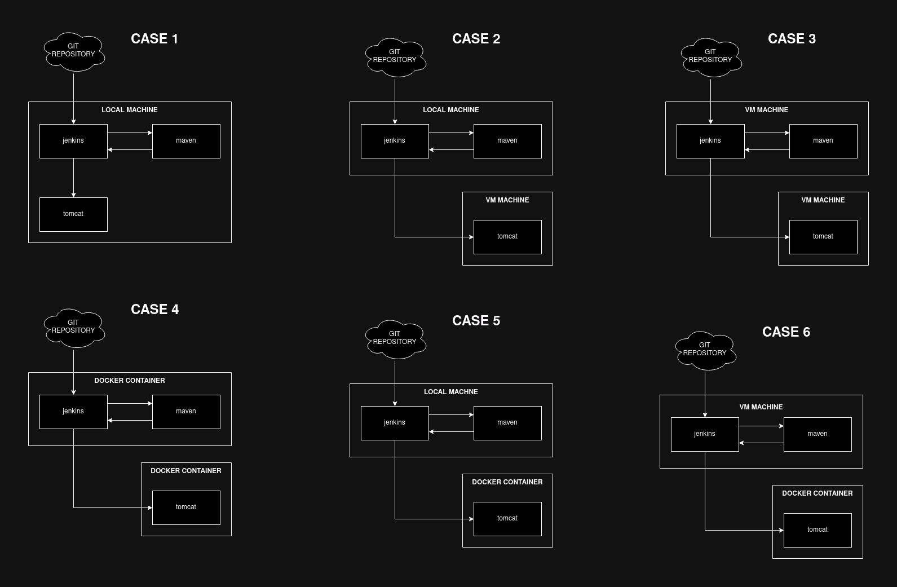

# DEPLOY HELPER
Make a deployment using one specific and easy way

## Summary

- <a href="#JENKINS-JAVA-SPRING_BOOT-MAVEN-TOMCAT">JENKINS JAVA SPRING-BOOT MAVEN TOMCAT</a>
- <a href="#JENKINS-JAVA-SPRING_BOOT-MAVEN-SSH-NOHUP">JENKINS JAVA SPRING-BOOT MAVEN SSH NOHUP</a>
- <a href="#JENKINS-JAVA-SPRING_BOOT-MAVEN-SSH-NOHUP-PIPELINE">JENKINS JAVA SPRING-BOOT MAVEN SSH NOHUP PIPELINE</a>

## Overview

Blow we have a few examples for use case of Jenkins as a CI/CD tool

[//]: # (------------------------------------------------------------------------------------------------------------)

  

## JENKINS JAVA SPRING_BOOT MAVEN TOMCAT

### Pre-requisites

- GitHUB Repository
- Java Version 17
- Jenkins Version: 2.484
- Tomcat Version: 9.0.96
- Docker
- Docker Compose
- Spring Boot 2.6.4

### Java Spring: Java Spring Boot Project Create

To optimize the time of development and tests to check this tutorial document use the "simple api demo" repository 
hosted in the GitHUB website in the following address: https://github.com/huntercodexs/simple-api-demo.git 
branch tomcat-release. After you have made the clone of this repository, check the required features in the Java 
Spring Boot project to run in the Tomcat Server.

- pom.xml file

<code>

    <packaging>war</packaging>
    ...
    ...
    ...
    <!--TOMCAT-->
    <dependency>
        <groupId>org.springframework.boot</groupId>
        <artifactId>spring-boot-starter-tomcat</artifactId>
        <scope>provided</scope>
    </dependency>
    ...
    ...
    ...
	<build>
		<plugins>
			<plugin>
				<groupId>org.apache.maven.plugins</groupId>
				<artifactId>maven-shade-plugin</artifactId>
				<version>3.2.4</version>
				<configuration>
					<createDependencyReducedPom>false</createDependencyReducedPom>
				</configuration>
				<executions>
					<execution>
						<phase>package</phase>
						<goals>
							<goal>shade</goal>
						</goals>
					</execution>
				</executions>
			</plugin>
		</plugins>
	</build>

</code>

- main class java

<code>

    import org.springframework.boot.SpringApplication;
    import org.springframework.boot.autoconfigure.SpringBootApplication;
    import org.springframework.boot.builder.SpringApplicationBuilder;
    import org.springframework.boot.web.servlet.support.SpringBootServletInitializer;
    
    @SpringBootApplication
    public class SimpleApiDemoApplication extends SpringBootServletInitializer {
    
        @Override
        protected SpringApplicationBuilder configure(SpringApplicationBuilder application) {
            return application.sources(SimpleApiDemoApplication.class);
        }
    
        public static void main(String[] args) {
            SpringApplication.run(SimpleApiDemoApplication.class, args);
        }
    
    }

</code>

In the above code we can see the extends for SpringBootServletInitializer and the @Override that serve to set up the 
java spring boot application to run in the tomcat server.

### GitHUB: Repository Create

> NOTE: This tutorial offer a simple/sample repository to tests or study the jenkins workflow process, and it means 
> that you don't need to create and publish a new repository just for tests goals, however, if you want to improve 
> your skill over deployment, you should to create yur own repository and publish it in your GitHub account.

The information from GitHub account are:

- GitHub Project URL: https://github.com/huntercodexs/simple-api-demo.git
- GitHub Account Username: {USERNAME}
- GitHub Account Password: {PASSWORD}
- GitHub Account Branch: tomcat-release

### Tomcat: Container Create

To create a Tomcat container use the repository: https://github.com/huntercodexs/docker-series.git.
After you create the container, from the repository just mentioned, start the docker container using the following command

<pre>
docker-compose start
</pre>

Now you must make some changes in the Tomcat Container

- Fix the tomcat webapps to avoid 404 Not Found error

<pre>
docker exec -it tomcat /bin/bash
mv webapps webapps2
mv webapps.dist/ webapps
</pre>

- Change the webapps/manager/META-INF/context.xml and webapps/host-manager/META-INF/context.xml file in the follow way

<code>

    <Context antiResourceLocking="false" privileged="true">
        <!--<CookieProcessor className="org.apache.tomcat.util.http.Rfc6265CookieProcessor"
                         sameSiteCookies="strict" />-->
        <!--<Valve className="org.apache.catalina.valves.RemoteAddrValve"
               allow="127\.\d+\.\d+\.\d+|::1|0:0:0:0:0:0:0:1" />-->
        <!--<Manager sessionAttributeValueClassNameFilter="java\.lang\.(?:Boolean|Integer|Long|Number|String)|org\.apache\.catalina\.filters\.CsrfPreventionFilter\$LruCache(?:\$1)?|java\.util\.(?:Linked)?HashMap"/>-->
    </Context>

</code>

- Change the conf/tomcat-users.xml file

<code>

    <tomcat-users xmlns="http://tomcat.apache.org/xml"
              xmlns:xsi="http://www.w3.org/2001/XMLSchema-instance"
              xsi:schemaLocation="http://tomcat.apache.org/xml tomcat-users.xsd"
              version="1.0">
        ...
        ...
        ...
        <role rolename="tomcat"/>
        <role rolename="admin"/>
        <role rolename="manager"/>
        <role rolename="robot"/>
    
        <user username="admin" password="admin" roles="manager-gui,admin-gui,manager-script"/>
        <user username="robot" password="robot" roles="manager-script"/>
        <user username="manager" password="manager" roles="manager-gui"/>
        <user username="robot" password="robot" roles="manager-script"/>
    </tomcat-users>

</code>

> TIP: The username robot is used to make deploys in the tomcat server

### Jenkins: Docker Container Create

To create a Jenkins container use the repository: https://github.com/huntercodexs/docker-series.git.
After you create the container, from the repository just mentioned, start the docker container using the following command

<pre>
docker-compose start
</pre>

Goto the web browser and type the http://localhost:39090/, make the proper configurations or entry with your login in 
the login screen. After you get access to the Jenkins Dashboard, you can create one job to automate the process of deploy. 
In order to make it you need to follow the instructions below:

###### Jenkins: Plugin Deploy Install

One important step is to install a proper and required plugin to deploy projects inside a docker container, for that 
goto the jenkins dashboard and click on "Manage Jenkins", lookup for Plugins and click on it. 

In the Available plugins you should type "deploy" and choose the following plugin:

<pre>
Deploy to container Plugin Version 1.16
This plugin allows you to deploy a war to a container after a successful build.
Glassfish 3.x remote deployment
Report an issue with this plugin
</pre>

###### Jenkins: Maven Configuration

This is a separated and important step, follow this steps to achieve a real success in the process. Once you are logged 
in the jenkins dashboard, goto the http://localhost:39090/configureTools/ url and scroll down until Maven installation. 
Click on "Add Maven" and choose the Version for maven compiler, for example 3.6.3, also give a name for this Maven 
installation, for example MAVEN_HOME.

- Click on "New Item"
- Enter an item name, for example: simple-api-demo
- Select "Freestyle project" and click on "OK" button
- Fill the form to create a job
  - General
    - Description: SIMPLE API DEMO
    - GitHub project: https://github.com/huntercodexs/simple-api-demo.git
    - Source Code Management
      - Git
        - Repository URL: https://github.com/huntercodexs/simple-api-demo.git
        - Credentials: huntercodexs:password (the username and password of the github account)
        - Branch Specifier (blank for 'any'): */tomcat-release (for example: tomcat-release)
    - Triggers
      - Poll SCM: * * * * *
    - Environment
      - Delete workspace before build starts
    - Build Steps 
      - Invoke top-level Maven targets
        - Maven Version (this one should be configured previously - see the Maven Configuration above)
        - Goals (for example: clean compile package)
    - Post-build Actions
      - Deploy war/ear to a container
        - WAR/EAR files: **/*.war
        - Context path: simple-api-demo
        - Containers (Add container)
          - Credentials: robot:robot
          - Tomcat URL: http://localhost:38080/
  - Click on Apply and Save
- Now in the JOB dashboard click on "Build Now" to deploy the project

[//]: # (------------------------------------------------------------------------------------------------------------)

  

## JENKINS JAVA SPRING_BOOT MAVEN SSH NOHUP

### Pre-requisites

- SSH
- GitHUB Repository
- Java Version 17
- Jenkins Version: 2.484
- SSH Plugin for Jenkins
- Spring Boot 2.6.4
- Linux commands knowledge

### Java Spring: Java Spring Boot Project Create

To optimize the time of development and tests to check this tutorial document use the "simple api demo" repository
hosted in the GitHUB website in the following address: https://github.com/huntercodexs/simple-api-demo.git
branch jar-release. After you have made the clone of this repository, check the required features in the Java
Spring Boot pom.xml file project to run in the Server.

- pom.xml file

<code>

    <packaging>jar</packaging>
    ...
    ...
    ...
	<build>
		<plugins>
			<plugin>
				<groupId>org.apache.maven.plugins</groupId>
				<artifactId>maven-shade-plugin</artifactId>
				<version>3.2.4</version>
				<configuration>
					<createDependencyReducedPom>false</createDependencyReducedPom>
				</configuration>
				<executions>
					<execution>
						<phase>package</phase>
						<goals>
							<goal>shade</goal>
						</goals>
					</execution>
				</executions>
			</plugin>
			<plugin>
				<groupId>org.apache.maven.plugins</groupId>
				<artifactId>maven-jar-plugin</artifactId>
				<version>3.3.0</version>
				<configuration>
					<archive>
						<manifest>
							<addClasspath>true</addClasspath>
							<mainClass>com.huntercodexs.simpleapidemo.SimpleApiDemoApplication</mainClass>
						</manifest>
					</archive>
				</configuration>
			</plugin>
		</plugins>
	</build>

</code>

- application.properties file

<pre>
server.port=38001
</pre>

The application properties file serve to set up the port number for the offer the service.

### GitHUB: Create Repository

> NOTE: This tutorial offer a simple/sample repository to tests or study the jenkins workflow process, and it means
> that you don't need to create and publish a new repository just for tests goals, however, if you want to improve
> your skill over deployment, you should to create yur own repository and publish it in your GitHub account.

The information from GitHub account are:

- GitHub Project URL: https://github.com/huntercodexs/simple-api-demo.git
- GitHub Account Username: {USERNAME}
- GitHub Account Password: {PASSWORD}
- GitHub Account Branch: jar-release

### Server: Configure the Server to deploy

- Allow the SSH

> see the [SSH-TIPS.md](SSH-TIPS.md) and [MFA-LINUX.md](MFA-LINUX.md)

- Allow the SSH Port 22 in the firewall

<pre>
sudo ufw allow 38001/tcp
sudo ufw reload
</pre>

- Create the folder structure to deploy

<pre>
mkdir -p /home/$USER/Deployment/
</pre>

> NOTE: The application deployment will be made inside of that folder, for example: one application named as 
> simple-api-demo, became /home/$USER/Deployment/simple-api-demo/

### Jenkins: Docker Container Create

To create a Jenkins container use the repository: https://github.com/huntercodexs/docker-series.git.
After you create the container, from the repository just mentioned, start the docker container using the following command

<pre>
docker-compose start
</pre>

Goto the web browser and type the http://localhost:39090/, make the proper configurations or entry with your login in
the login screen. After you get access to the Jenkins Dashboard, you can create one job to automate the process of deploy.
In order to make it you need to follow the instructions below:

###### Jenkins: Plugin Deploy Install

In this case you will need to install the following plugins

- SSH Publisher
- SSH Plugin
- Publish Over SSH
- SSH Agent Plugin
- SSH Build Agents plugin
- SSH Credentials Plugin
- SSH Pipeline Steps
- SSH server
- Maven Integration plugin
- Pipeline Maven Integration Plugin
- Pipeline Maven Plugin API Version

###### Jenkins: Configuration

Once you have installed the correct plugins, you need to configure each of these plugins.

- CREDENTIALS

  - Goto the Jenkins dashboard and lookup for "Manage Jenkins" > "Credentials"
  - You can create a "Domain" or just create a new "Credential" inside an existent domain

- SSH

  - Goto the Jenkins dashboard and lookup for "Manage Jenkins" > "System"
  - Scroll down until "SSH remote hosts" and click on Add button
    - Fill the form:
      - Hostname: 192.168.0.24
      - Port: 22
      - Credentials: {credentials} (previously created)
      - serverAliveInterval: 0
      - timeout: 0
  - Scroll down until "SSH Servers"
    - Name: {ssh-server}
    - Hostname: 192.168.0.24
    - Username: {username}
    - Remote Directory: /home/ubuntu-vbox/Deployment
  
- JDK

  - Now, goto the Jenkins dashboard and lookup for "Manage Jenkins" > "Tools"
  - Scroll down "JDK installations" and click on "Add JDK"
  - Inform the Name and JAVA_HOME for each one

- MAVEN

  - Now, goto the Jenkins dashboard and lookup for "Manage Jenkins" > "Tools"
  - Scroll down until "Maven installations" and click on "Add Maven" button
  - Type the Name field, for example: MAVEN_HOME_DIR
  - Type the MAVEN_HOME field, for example: /opt/maven

Also, you can mark the option "Install automatically" and choose the Maven Version to apply, in case you 
need more information about Maven Installation, just follow this document [NEXUS_AND_MAVEN.md](NEXUS_AND_MAVEN.md)

###### Jenkins: Job Create

To create a new job that means configure one workflow to deploy any application, follow these steps

- Goto Jenkins Dashboard
- Click on "New Item"
- Type a name in the input "Enter an item name"
- Choose the "Maven project" as project type
- Click on OK

Now in the Configuration form page fill entry with the following details

- General
  - Description: SIMPLE API DEMO
  - GitHub project: https://github.com/huntercodexs/simple-api-demo.git/
  - JDK: java17 (previously created)
- Source Code Management
  - Repository URL: https://github.com/huntercodexs/simple-api-demo.git
  - Credentials: Choose the credentials
  - Branch Specifier (blank for 'any'): */jar-release
- Triggers
  - let as is
- Environment
  - Mark the "Delete workspace before build starts" checkbox
  - Mark the "Send files or execute commands over SSH after the build runs"
    - SSH Server
      - Name: Select the targeted server
      - Transfers
        - Source files: **/application.properties
        - Remote directory: simple-api-demo
  - Mark the "Execute shell script on remote host using ssh"
    - SSH site: Choose the ssh connection created previously
    - Pre build script

<pre>
TIMESTAMP=$(date +"%F-%T")
BACKUP_DIR="/home/ubuntu-vbox/Deployment/simple-api-demo/target/backup/$TIMESTAMP"
mkdir -p $BACKUP_DIR
tomcat_pid() {
  echo `ps -ef | grep java | grep "simple-api-demo" | grep -v grep | awk '{ print $2 }'`
}
pid=$(tomcat_pid)
kill -9 $pid
cp /home/ubuntu-vbox/Deployment/simple-api-demo/target/simple-api-demo-1.0.0-SNAPSHOT.jar $BACKUP_DIR >> /dev/null 2>&1 || echo "JAR FILE NOT FOUND"
</pre>

- Pre Steps
  - let as is
- Build
  - Maven Version: Select the maven version available in the system
  - Root POM: pom.xml
  - Goals and option: clean compile package
- Post Steps
  - Select "Run only if build succeeds"
  - Click on "Add post-build step" and select "Invoke top-level Maven targets"
    - Select the "Maven Version": JENKINS_MAVEN_HOME-3.6.3
    - Type the "Goals": clean install
- Build Settings
  - let as is
- Post-build Actions
  - Select "Send build artifacts over SSH"
    - In "SSH Server" select the targeted server
    - In Transfers > Transfer Set > Source files: target/simple-api-demo-1.0.0-SNAPSHOT.jar
    - In "Remote directory" type: simple-api-demo
    - In "Exec command" type
<pre>
nohup java -jar /home/ubuntu-vbox/Deployment/simple-api-demo/target/simple-api-demo-1.0.0-SNAPSHOT.jar --spring.config.location=/home/ubuntu-vbox/Deployment/simple-api-demo/target/classes/application.properties > /home/ubuntu-vbox/Deployment/simple-api-demo/service.out 2> /home/ubuntu-vbox/Deployment/simple-api-demo/errors.txt < /dev/null &
</pre>
  - Add "Delete workspace when build is done"

Below we can see these steps illustrated in the sequence a logical flows

Now you can just click on "Build Now" in the job dashboard to deploy effectively this job. After build and deploy 
successfully, goto the browser or postman tool and make one request like below:

<pre>
GET http://192.168.0.24:38001/welcome
</pre>

[//]: # (------------------------------------------------------------------------------------------------------------)

  

## JENKINS JAVA SPRING_BOOT MAVEN SSH NOHUP PIPELINE

In this topic we will use the Jenkinsfile to make a sample deploy in one virtual machine named ubuntu-vbox. 

### Pre-requisites

- SSH
- GitHUB Repository
- Java Version 17
- Jenkins Version: 2.484
- Spring Boot 2.6.4
- Jenkinsfile Pipeline Script
- Linux commands knowledge
  - SSH KEYGEN
  - SSH COPY ID
- Virtualbox
  - Ubuntu 20.04

### Java Spring: Java Spring Boot Project Create

To optimize the time of development and tests to check this tutorial document use the "simple api demo" repository
hosted in the GitHUB website in the following address: https://github.com/huntercodexs/simple-api-demo.git
branch pipelinr-release. After you have made the clone of this repository, check the required features in the Java
Spring Boot pom.xml file project to run in the Server.

- pom.xml file

<code>
    
    ...
    ...
    ...
	<build>
		<plugins>
			<plugin>
				<groupId>org.apache.maven.plugins</groupId>
				<artifactId>maven-shade-plugin</artifactId>
				<version>3.2.4</version>
				<configuration>
					<createDependencyReducedPom>false</createDependencyReducedPom>
				</configuration>
				<executions>
					<execution>
						<phase>package</phase>
						<goals>
							<goal>shade</goal>
						</goals>
					</execution>
				</executions>
			</plugin>
			<plugin>
				<groupId>org.apache.maven.plugins</groupId>
				<artifactId>maven-jar-plugin</artifactId>
				<version>3.3.0</version>
				<configuration>
					<archive>
						<manifest>
							<addClasspath>true</addClasspath>
							<mainClass>com.huntercodexs.simpleapidemo.SimpleApiDemoApplication</mainClass>
						</manifest>
					</archive>
				</configuration>
			</plugin>
		</plugins>
	</build>

</code>

- application.properties file

<pre>
server.port=38003
</pre>

- Jenkinsfile

<pre>
pipeline {
	agent any

	environment {
		mavenHome = tool 'JENKINS_MAVEN_HOME-3.6.3'
	}

	tools {
	    maven "JENKINS_MAVEN_HOME-3.6.3"
		jdk 'java17-native'
	}

	stages {

        stage('Checkout') {
            steps {
                git branch: 'pipeline-release', url: 'https://github.com/huntercodexs/simple-api-demo.git'
            }
        }

		stage('Test'){
			steps{
				sh "mvn test"
			}
		}

		stage('Build'){
			steps {
				sh "mvn clean install -DskipTests"
			}
		}

		stage('Deploy') {
            steps {
                // Needs to generate key pairs between host and server: ssh-keygen + ssh-copy-id
                sh '''
                ssh ubuntu-vbox@192.168.0.24 "mkdir -p /home/ubuntu-vbox/Deployment/simple-api-demo/backup"
                scp target/classes/application.properties ubuntu-vbox@192.168.0.24:/home/ubuntu-vbox/Deployment/simple-api-demo/application.properties
                scp target/simple-api-demo-1.0.0-SNAPSHOT.jar ubuntu-vbox@192.168.0.24:/home/ubuntu-vbox/Deployment/simple-api-demo/simple-api-demo-1.0.0-SNAPSHOT.jar
                ssh ubuntu-vbox@192.168.0.24 "nohup java -jar /home/ubuntu-vbox/Deployment/simple-api-demo/simple-api-demo-1.0.0-SNAPSHOT.jar --spring.config.location=/home/ubuntu-vbox/Deployment/simple-api-demo/application.properties > /home/ubuntu-vbox/Deployment/simple-api-demo/service.out 2> /home/ubuntu-vbox/Deployment/simple-api-demo/errors.txt < /dev/null &"
                '''
            }
        }
	}

	post {
        success {
            echo 'Build and Deploy succeeded!'
        }
        failure {
            echo 'Build or Deploy failed!'
        }
    }
}
</pre>

The application properties file serve to set up the port number for the offer the service.

### GitHUB: Create Repository

> NOTE: This tutorial offer a simple/sample repository to tests or study the jenkins workflow process, and it means
> that you don't need to create and publish a new repository just for tests goals, however, if you want to improve
> your skill over deployment, you should to create yur own repository and publish it in your GitHub account.

The information from GitHub account are:

- GitHub Project URL: https://github.com/huntercodexs/simple-api-demo.git
- GitHub Account Username: {USERNAME}
- GitHub Account Password: {PASSWORD}
- GitHub Account Branch: pipeline-release

### Server: Configure the Server to deploy

- Allow the SSH

> see the [SSH-TIPS.md](SSH-TIPS.md) and [MFA-LINUX.md](MFA-LINUX.md)

- Allow the SSH Port 22 in the firewall

<pre>
sudo ufw allow 38003/tcp
sudo ufw reload
</pre>

> IMPORTANT: Create the ssh pub key in the Jenkins machine and in the Ubuntu machine, after that make sure you have
> shared this keys between these machines using the ssh-copy-id user@server-ip

- User: jenkins

<pre>
jenkins@c167e65d1537:~$ ssh-copy-id ubuntu-vbox@192.168.0.24
/usr/bin/ssh-copy-id: INFO: Source of key(s) to be installed: "/var/jenkins_home/.ssh/id_rsa.pub"
The authenticity of host '192.168.0.24 (192.168.0.24)' can't be established.
ED25519 key fingerprint is SHA256:FTrC2tVhWPbYrfB0vcwiasBheEdxHJ24UNhEY1gro4c.
This key is not known by any other names.
Are you sure you want to continue connecting (yes/no/[fingerprint])? yes
/usr/bin/ssh-copy-id: INFO: attempting to log in with the new key(s), to filter out any that are already installed
/usr/bin/ssh-copy-id: INFO: 1 key(s) remain to be installed -- if you are prompted now it is to install the new keys
ubuntu-vbox@192.168.0.24's password: 

Number of key(s) added: 1

Now try logging into the machine, with:   "ssh 'ubuntu-vbox@192.168.0.24'"
and check to make sure that only the key(s) you wanted were added.
</pre>

- User: root

<pre>
root@c167e65d1537:/var/jenkins_home# ssh-copy-id ubuntu-vbox@192.168.0.24
/usr/bin/ssh-copy-id: INFO: Source of key(s) to be installed: "/root/.ssh/id_rsa.pub"
/usr/bin/ssh-copy-id: INFO: attempting to log in with the new key(s), to filter out any that are already installed
/usr/bin/ssh-copy-id: INFO: 1 key(s) remain to be installed -- if you are prompted now it is to install the new keys
ubuntu-vbox@192.168.0.24's password: 

Number of key(s) added: 1

Now try logging into the machine, with:   "ssh 'ubuntu-vbox@192.168.0.24'"
and check to make sure that only the key(s) you wanted were added.
</pre>

### Jenkins: Docker Container Create

To create a Jenkins container use the repository: https://github.com/huntercodexs/docker-series.git.
After you create the container, from the repository just mentioned, start the docker container using the following command

<pre>
docker-compose start
</pre>

Goto the web browser and type the http://localhost:39090/, make the proper configurations or entry with your login in
the login screen. After you get access to the Jenkins Dashboard, you can create one job to automate the process of deploy.
In order to make it you need to follow the instructions below:

###### Jenkins: Plugin Deploy Install

In this case you will need to install the following plugins

- SSH Publisher (Optional)
- SSH Plugin (Optional)
- Publish Over SSH (Optional)
- SSH Agent Plugin (Optional)
- SSH Build Agents plugin (Optional)
- SSH Credentials Plugin (Optional)
- SSH Pipeline Steps (Optional)
- SSH server (Optional)
- Maven Integration plugin
- Pipeline Maven Integration Plugin
- Pipeline Maven Plugin API Version

###### Jenkins: Configuration

Once you have installed the correct plugins, you need to configure each of these plugins.

- JDK

  - Now, goto the Jenkins dashboard and lookup for "Manage Jenkins" > "Tools"
  - Scroll down "JDK installations" and click on "Add JDK"
  - Inform the Name and JAVA_HOME for each one

- MAVEN

  - Now, goto the Jenkins dashboard and lookup for "Manage Jenkins" > "Tools"
  - Scroll down until "Maven installations" and click on "Add Maven" button
  - Type the Name field, for example: MAVEN_HOME_DIR
  - Type the MAVEN_HOME field, for example: /opt/maven

Also, you can mark the option "Install automatically" and choose the Maven Version to apply, in case you
need more information about Maven Installation, just follow this document [NEXUS_AND_MAVEN.md](NEXUS_AND_MAVEN.md)

###### Jenkins: Job Create

To create a new job that means to configure one workflow to deploy any application, follow these steps

- Goto Jenkins Dashboard
- Click on "New Item"
- Type a name in the input "Enter an item name"
- Choose the "Pipeline" as project type
- Click on OK

Now in the Configuration form page fill entry with the following details

- General
  - Description: PIPELINE - SIMPLE API DEMO
  - GitHub project: https://github.com/huntercodexs/simple-api-demo.git/
- Build Triggers
  - let as is
- Advanced Project Options
  - let as is
- Pipeline
  - Definition: Pipeline script from SCM
    - SCM: Git 
      - Repository URL: https://github.com/huntercodexs/simple-api-demo.git
      - Credentials: Choose the credentials
      - Branch Specifier (blank for 'any'): */pipeline-release
    - Script Path: Jenkinsfile

Now you can just click on "Build Now" in the job dashboard to deploy effectively this job. After build and deploy
successfully, goto the browser or postman tool and make one request like below:

<pre>
GET http://192.168.0.24:38003/welcome
</pre>

> Remember that in this case we are using the Jenkinsfile setup to configure every step and run the deployment 
> automatically when the trigger were dispatched.

If everything was fine you should be able to see something like below in your Jenkins Job Dashboard

[//]: # (------------------------------------------------------------------------------------------------------------)

  

## Sources References

- https://howtodoinjava.com/devops/setup-jenkins-pipeline-for-spring-boot-app/
- https://cloudsbaba.com/how-to-deploy-the-spring-boot-application-with-the-help-of-jenkins-ci-cd/
- https://javafullstackdev.medium.com/streamline-your-spring-boot-deployments-with-jenkins-a-step-by-step-tutorial-for-2024-0fd6a75fa6a1
- https://medium.com/@shubhangi.thakur4532/deploy-spring-boot-application-using-jenkins-with-github-integration-9d28c99ea168
- https://dev.to/javafullstackdev/jenkins-and-spring-boot-a-comprehensive-guide-5f20
- https://www.geeksforgeeks.org/deployment-of-spring-boot-application-in-jenkins/
- https://www.theserverside.com/blog/Coffee-Talk-Java-News-Stories-and-Opinions/How-to-deploy-a-JAR-file-to-Tomcat-the-right-way
- https://www.guru99.com/pt/jenkins-pipeline-tutorial.html
- https://blog.4linux.com.br/criando-pipelines-no-jenkins-com-jenkinsfile/

