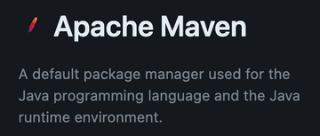
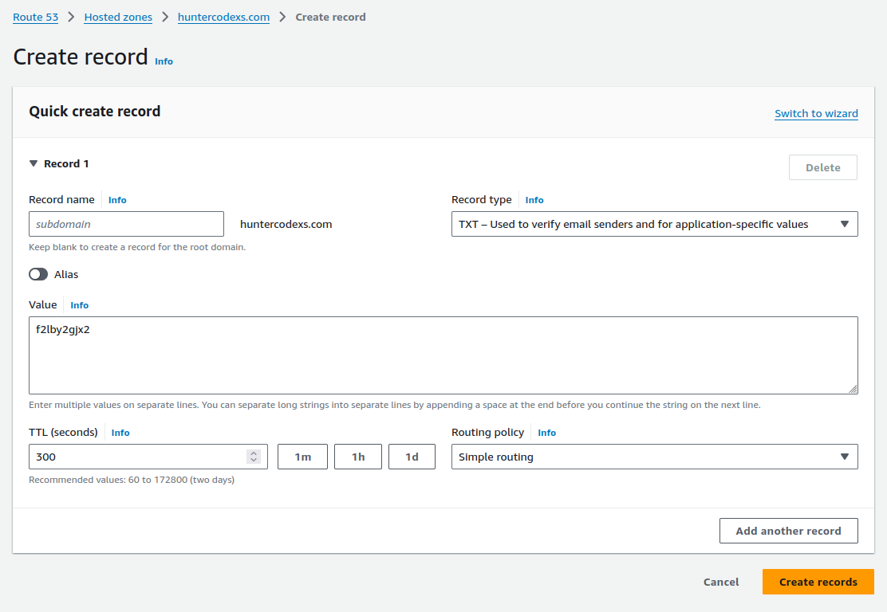
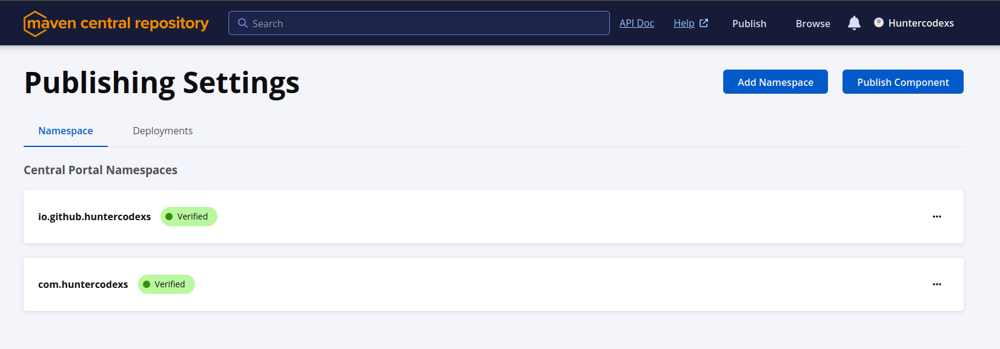
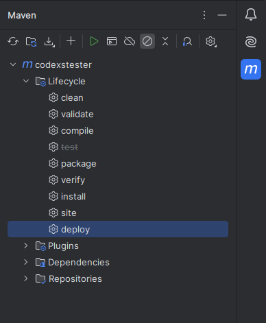
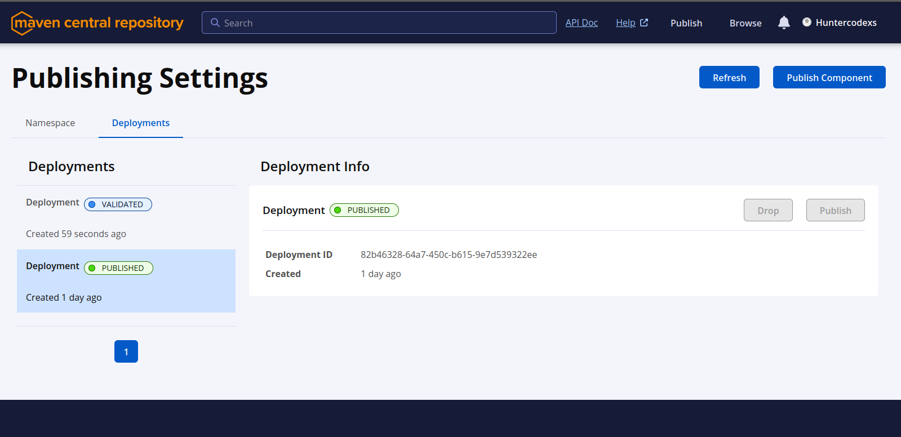
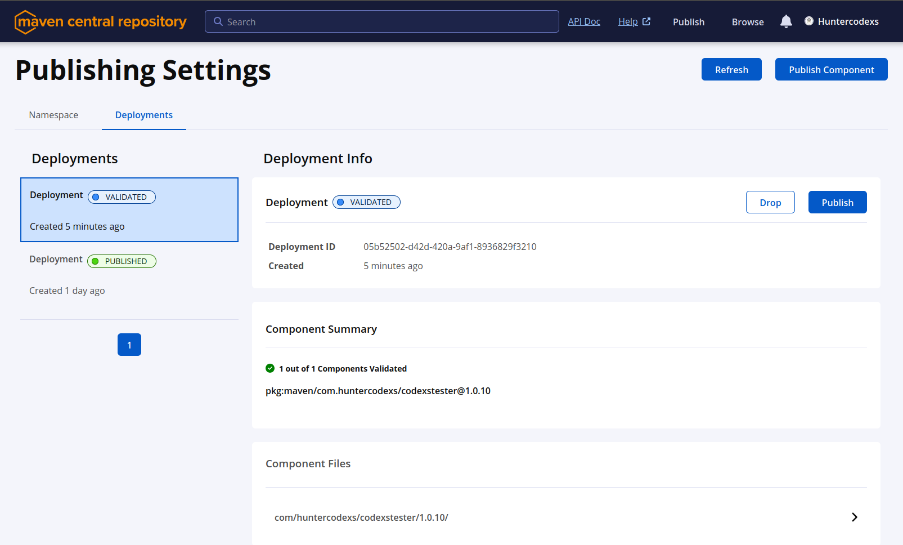
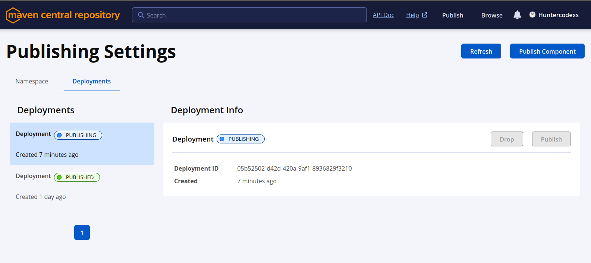
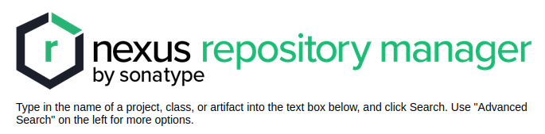

# MAVEN HELPER

This documentation cover the subjects below

- How to Publish Packages in the GitHub Packages 
- How to Publish Packages in the Maven Central Repository 
- How to Publish Packages in the Nexus Repository Manager 

## GitHub Packages - Publishing Packages

- Create one personal access token
  - GitHub Account > Settings > Developers settings > Personal access token
    - Generate the token with the "write:packages" permissions

- Configure the settings.xml file for Maven

<pre>
/home/{USER}/.m2/settings.xml
</pre>

<code>

    <settings xmlns="http://maven.apache.org/SETTINGS/1.0.0"
        xmlns:xsi="http://www.w3.org/2001/XMLSchema-instance"
        xsi:schemaLocation="http://maven.apache.org/SETTINGS/1.0.0
        http://maven.apache.org/xsd/settings-1.0.0.xsd">
    
        <servers>
            <server>
            <id>github</id>
            <username>{GITHUB_ACCOUNT}</username>
            <password>{GITHUB_PERSONAL_ACCESS_TOKEN}</password>
            </server>
        </servers>
    
        <profiles>
            <profile>
            <id>github</id>
            <repositories>
                <repository>
                <id>central</id>
                <url>https://repo1.maven.org/maven2</url>
                </repository>
                <repository>
                <id>github</id>
                <url>https://maven.pkg.github.com/{GITHUB_ACCOUNT}/{GITHUB_REPOSITORY}</url>
                <snapshots>
                    <enabled>true</enabled>
                </snapshots>
                </repository>
            </repositories>
            </profile>
        </profiles>
    
        <activeProfiles>
            <activeProfile>github</activeProfile>
        </activeProfiles>
    </settings>

</code>

- Crete one java project and configure the pom.xml as something like below

<code>

    <?xml version="1.0" encoding="UTF-8"?>
    <project xmlns="http://maven.apache.org/POM/4.0.0" xmlns:xsi="http://www.w3.org/2001/XMLSchema-instance"
    xsi:schemaLocation="http://maven.apache.org/POM/4.0.0 https://maven.apache.org/xsd/maven-4.0.0.xsd">
    
        <modelVersion>4.0.0</modelVersion>
        <parent>
            <groupId>org.springframework.boot</groupId>
            <artifactId>spring-boot-starter-parent</artifactId>
            <version>{SPRING_BOOT_VERSION}</version>
            <relativePath/> <!-- lookup parent from repository -->
        </parent>
        
        <packaging>jar</packaging>
    
        <version>{PACKAGE_VERSION}</version>
        <groupId>{PACKAGE_GROUP_ID}</groupId>
    
        <name>{PACKAGE_NAME}</name>
        <artifactId>{PACKAGE_ARTIFACT_ID}</artifactId>
        <description>{PACKAGE_DESCRIPTION}</description>
    
        <properties>
            <java.version>{JAVA_VERSION}</java.version>
            <project.build.sourceEncoding>UTF-8</project.build.sourceEncoding>
            <project.reporting.outputEncoding>UTF-8</project.reporting.outputEncoding>
        </properties>
    
        <dependencies>
            ...
        </dependencies>
    
        <repositories>
            ...
        </repositories>
    
        <pluginRepositories>
            ...
        </pluginRepositories>
    
        <build>
            <plugins>
    
                <!--Generate Final Jar with all dependency-->
                <plugin>
                    <groupId>org.apache.maven.plugins</groupId>
                    <artifactId>maven-shade-plugin</artifactId>
                    <version>3.2.4</version>
                    <configuration>
                        <createDependencyReducedPom>false</createDependencyReducedPom>
                    </configuration>
                    <executions>
                        <execution>
                            <phase>package</phase>
                            <goals>
                                <goal>shade</goal>
                            </goals>
                        </execution>
                    </executions>
                </plugin>
    
            </plugins>
        </build>
    
        <distributionManagement>
            <repository>
                <id>github</id>
                <url>https://maven.pkg.github.com/{GITHUB_ACCOUNT}/{GITHUB_REPOSITORY}</url>
            </repository>
        </distributionManagement>
    
    </project>

</code>

- Create the environment variables

<pre>
export GITHUB_ACCOUNT={ACCOUNT}
export GITHUB_REPOSITORY={REPOSITORY}
export GITHUB_PERSONAL_ACCESS_TOKEN={TOKEN}
</pre>

- Execute the maven command to deploy

<pre>
mvn deploy
</pre>

- Now import the package in another java project, for example:

<code>

    <dependency>
        <groupId>{PACKAGE_DOMAIN}</groupId>
        <artifactId>{PACKAGE_ARTIFACT_ID}</artifactId>
        <version>{PACKAGE_VERSION}</version>
        <scope>provided</scope>
        <exclusions>
            <exclusion>
                <groupId>com.vaadin.external.google</groupId>
                <artifactId>android-json</artifactId>
            </exclusion>
        </exclusions>
    </dependency>

</code>

- OK, now it is possible to use the resources provided by the current imported package.

### Full Real Example

You can find a full java project example in the following link:
https://github.com/huntercodexs/codexstester/tree/release-1.0.9--java-8-spring-boot-2.6.4--deploy-github-packages

## Maven Central Repository by Sonatype - Publishing one jar file to the

### About

This article offer a logical and procedural step by step to achieve the complete flow to deploy one jar file into
maven central repository. So you can read this entirely file to get enough knowledge about this process and after
that execute item by item contained in this one.

> Source: https://central.sonatype.org/register/central-portal/

### Account

- Create one account in the sonatype website: https://central.sonatype.com/
- It is possible to use any social media like GitHUB and Google account to make a login

### Namespace

- Claim for a namespace that you have and that you are de owner, for example: com.huntercodexs
- Look up for "View Namespaces" section in the menu of maven website and click on it
- Click in the "Verify Namespace" to verify the created namespace
- In this point, if you create the account using GitHUB, the process will be made automatically to verify the own and trust of the current namespace
    - the namespace it will be something like: io.github.com.username
- If you have created a new account without social media, or want to create a new namespace, follow the instructions:
    - Get the value generated for TXT Record in the maven panel;
    - Go to the hosting service and create a record usgin this value, for example:
      - AWS Route 53;
      - GoDaddy;
      - Hostinger;
- AWS Route 53 example

- At this point the namespace verify should be Verified

### GPG Keys

> NOTE: see the [GPG-HELPER.md](GPG-HELPER.md) to get all details about gpg keys

All packages that will be sending to the maven central should be assigned using the gpg key published in 
the gpg server keys.

### MAVEN Settings

> TIP: Use the commands below to configure the environments vars that will be used in the flow.

<pre>
export GPG_KEY_ID={gpg-key-id}
export GPG_SHORT_ID={gpg-short-key-id} //last 8 characters
export GPG_SHORT_ID_HEX=0x{gpg-key-id-hex} //last 8 characters in Hex
export GPG_PASSPHRASE='{gpg-passphrase}'
export SONATYPE_CENTRAL_USER={sonatype-user-token}
export SONATYPE_CENTRAL_TOKEN={sonatype-token-value}

source ~/.bashrc
source ~/.bash_profile
</pre>

> HINT: This documentation was made to follow in the logical and procedural way, 
> so don't skip or jump these step by step

#### Configure the settings.xml file for Maven

<pre>
/home/{USER}/.m2/settings.xml
</pre>

- Using Maven Apache

<code>

    <settings>
        <servers>
            <server>
              <id>central</id>
              <username>{SONATYPE_CENTRAL_USER}</username>
              <password>{SONATYPE_CENTRAL_TOKEN}</password>
            </server>
        </servers>
        <profiles>
            <profile>
                <activation>
                    <activeByDefault>true</activeByDefault>
                </activation>
                <properties>
                    <gpg.executable>gpg</gpg.executable>
                    <gpg.keyname>{GPG_SHORT_ID}</gpg.keyname>
                    <gpg.passphrase>{GPG_PASSPHRASE}</gpg.passphrase>
                </properties>
            </profile>
        </profiles>
    </settings>

</code>

### Project Requirements and POM Configuration

#### Maven Plugins

- Maven Shade Plugin

<code>

    <!--Build: Generate Final Jar with all dependency-->
    <plugin>
        <groupId>org.apache.maven.plugins</groupId>
        <artifactId>maven-shade-plugin</artifactId>
        <version>3.2.4</version>
        <configuration>
            <createDependencyReducedPom>false</createDependencyReducedPom>
        </configuration>
        <executions>
            <execution>
                <phase>package</phase>
                <goals>
                    <goal>shade</goal>
                </goals>
            </execution>
        </executions>
    </plugin>

</code>

- Maven Source Plugin

<code>

    <!--Deploy: Maven Sources-->
    <plugin>
        <groupId>org.apache.maven.plugins</groupId>
        <artifactId>maven-source-plugin</artifactId>
        <version>2.2.1</version>
        <executions>
            <execution>
                <id>attach-sources</id>
                <goals>
                    <goal>jar-no-fork</goal>
                </goals>
            </execution>
        </executions>
    </plugin>

</code>

- Maven Java Doc Plugin

> IMPORTANT: This plugin is required by the Sonatype, and it will be validated your Java Doc code, however, you use this 
> library without offering more risks.

Use the following rules and more to get everything ok

- Java Doc Revision
  - The auto closed elements is not allowed, for example:  
  - The element title should respect the hierarchy, for example: h1, h2, h3, h4, h5, h6
  - Use @throwns label when the method use the throwns in the signature method
  - Inform all @params that are been used by the method
  - Replace the tags <> per &lt; and &gt; respective
  - Don't use @apiNote
  - Inform the kind of @return for each method
  - Don't use SNAPSHOT in the releases versions, for example: 1.0.0-SNAPSHOT

<code>

    <!--Deploy: Maven JavaDoc-->
    <plugin>
        <groupId>org.apache.maven.plugins</groupId>
        <artifactId>maven-javadoc-plugin</artifactId>
        <version>2.9.1</version>
        <executions>
            <execution>
                <id>attach-javadocs</id>
                <goals>
                    <goal>jar</goal>
                </goals>
            </execution>
        </executions>
    </plugin>

</code>

- Maven GPG Plugin

All deploy components should be encrypted with pgp key (it is a requirement)

<code>

    <!--Deploy: GPG Assign-->
    <plugin>
        <groupId>org.apache.maven.plugins</groupId>
        <artifactId>maven-gpg-plugin</artifactId>
        <version>1.5</version>
        <executions>
            <execution>
                <id>sign-artifacts</id>
                <phase>verify</phase>
                <goals>
                    <goal>sign</goal>
                </goals>
                <!--To specify the GPG Key-->
                <configuration>
                    <keyname>{GPG_SHORT_ID1}</keyname>
                    <!--To avoid gpg error: signing failed: No such file or directory-->
                    <gpgArguments>
                        <arg>--pinentry-mode</arg>
                        <arg>loopback</arg>
                    </gpgArguments>
                </configuration>
            </execution>
        </executions>
    </plugin>

</code>

#### Publishing

- Using Maven Plugin

<code>

    <!--Deploy: Maven Publishing Central-->
    <plugin>
        <groupId>org.sonatype.central</groupId>
        <artifactId>central-publishing-maven-plugin</artifactId>
        <version>0.6.0</version>
        <extensions>true</extensions>
        <configuration>
            <publishingServerId>central</publishingServerId>
        </configuration>
    </plugin>

</code>

#### Distribution

<code>

	<!--Deploy: Distribution on Nexus OSSRH-->
	<distributionManagement>
		<repository>
			<id>central</id>
			<layout>default</layout>
			<name>Maven Central</name>
			<uniqueVersion>false</uniqueVersion>
			<url>https://central.sonatype.com/api/v1/publisher/upload</url>
		</repository>
	</distributionManagement>

</code>

### POM Requirements (Sufficient Data)

<code>

    <!--Deploy: Spring Information-->
	<modelVersion>4.0.0</modelVersion>
	<parent>
		<groupId>org.springframework.boot</groupId>
		<artifactId>spring-boot-starter-parent</artifactId>
		<version>{SPRING_BOOT_VERSION}</version>
		<relativePath/> <!-- lookup parent from repository -->
	</parent>

	<!--Deploy: Coordinates-->
	<packaging>jar</packaging>
	<groupId>{PACKAGE_DOMAIN}</groupId>
	<artifactId>{PACKAGE_ID}</artifactId>
	<version>{PACKAGE_VRESION}</version>

	<!--Deploy: ProjectName, Description and URL-->
	<name>{PACKAGE_NAME}</name>
	<description>{PACKAGE_DESCRIPTION}</description>
	<url>{PACKAGE_PROJECT_URL}</url>

	<!--Deploy: License Information-->
	<licenses>
		<license>
			<name>MIT License</name>
			<url>http://www.opensource.org/licenses/mit-license.php</url>
		</license>
        <license>
            <name>The Apache License, Version 2.0</name>
            <url>http://www.apache.org/licenses/LICENSE-2.0.txt</url>
        </license>
	</licenses>

	<!--Deploy: Developer Information-->
	<developers>
		<developer>
			<name>{DEVELOPER_NAME}</name>
			<email>{DEVELOPER_EMAIL_ADDRESS}</email>
			<organization>{ORGANIZATION_NAME}</organization>
			<organizationUrl>{ORGANIZATION_URL}m</organizationUrl>
		</developer>
	</developers>

	<!--Deploy: SCM Information-->
	<scm>
		<connection>scm:git:git://github.com/{GITHUB_USERNAME}/{GITHUB_REPOSITORY}</connection>
		<developerConnection>scm:git:ssh://github.com:{GITHUB_USERNAME}/{GITHUB_REPOSITORY}</developerConnection>
		<url>http://github.com/{GITHUB_USERNAME}/{GITHUB_REPOSITORY}/{BRANCH_RELEASE_VERSION}</url>
	</scm>

	<!--Deploy: Project Properties-->
	<properties>

		<!--Java Version-->
		<java.version>{JAVA_VERSION}</java.version>

		<!--Dependencies Versions - Optional-->
		<!--Example-->
		<junit.version>4.13.2</junit.version>
		<junit-jupiter.version>5.8.2</junit-jupiter.version>
		<junit-platform.version>1.10.3</junit-platform.version>
		<selenium.version>3.13.0</selenium.version>

		<!--Charset Encoding - Optional-->
		<project.build.sourceEncoding>UTF-8</project.build.sourceEncoding>
		<project.reporting.outputEncoding>UTF-8</project.reporting.outputEncoding>

	</properties>

</code>

### Project Deploy

<pre>
mvn clean
mvn deploy
</pre>

You can to use the IDEA controls to do that as well, in the IntelliJ use the right sidebar Maven to execute this 
operations according example below:

> IMPORTANT: After deploy is conclude goto the dashboard in your maven central account seek for the component that 
> was just deployed and click on Publish button, this step can take a few minutes or hours.

- Check the status of Deployments

As you can see in the above image there is two deployments, one VALIDATE and other PUBLISHED, the VALIDATE deployment 
is ready to Publish, so you just need to choose this deployment and follow clicking on Publish button according to the 
below illustration.

The status of deployment will be changed for PUBLISHING, and you can track that status pressing F5 from the keyboard 
to see what is the current one

When the status of deployment is PUBLISHED, so everything is done and ready to use.

### Import the dependency

In this case the component is already deployed, approved and published in the Maven Central Repository

<code>

    <!--MAVEN CENTRAL REPOSITORY-->
    <dependency>
        <groupId>{PACKAGE_DOMAIN}</groupId>
        <artifactId>{PACKAGE_ARTIFACT_ID}</artifactId>
        <version>{PACKAGE_VERSION}</version>
        <scope>provided</scope>
        <exclusions>
            <exclusion>
                <groupId>com.vaadin.external.google</groupId>
                <artifactId>android-json</artifactId>
            </exclusion>
        </exclusions>
    </dependency>

</code>

### Full Real Example

You can find a full java project example in the following link: 
https://github.com/huntercodexs/codexstester/tree/release-1.0.9--java-8-spring-boot-2.6.4--deploy-maven-central-repository

## Nexus Repository Manager by Sonatype - Publishing one jar file to the

Deprecated 

> Source: https://repository.apache.org/#welcome

#### Settings.xml

- Using Maven Plugin - central-publishing-maven-plugin

<code>

    <settings>
        <servers>
            <server>
                <id>central</id>
                <username>{OSSRH-USERNAME-TOKEN}</username>
                <password>{OSSRH-PASSWORD-TOKEN}</password>
            </server>
        </servers>
    </settings>

</code>

#### Distribution

<code>

    <distributionManagement>
        <snapshotRepository>
            <id>ossrh</id>
            <url>https://oss.sonatype.org/content/repositories/snapshots</url>
        </snapshotRepository>
        <repository>
            <id>ossrh</id>
            <url>https://oss.sonatype.org/service/local/staging/deploy/maven2/</url>
        </repository>
    </distributionManagement>

</code>

For new projects since February 2021

<code>

    <distributionManagement>
        <snapshotRepository>
            <id>ossrh</id>
            <url>https://s01.oss.sonatype.org/content/repositories/snapshots</url>
        </snapshotRepository>
        <repository>
            <id>ossrh</id>
            <url>https://s01.oss.sonatype.org/service/local/staging/deploy/maven2/</url>
        </repository>
    </distributionManagement>

</code>

#### Maven Plugins

- Maven Nexus Plugin

<code>

    <plugin>
        <groupId>org.sonatype.plugins</groupId>
        <artifactId>nexus-staging-maven-plugin</artifactId>
        <version>1.6.7</version>
        <extensions>true</extensions>
        <configuration>
            <serverId>ossrh</serverId>
            <nexusUrl>https://oss.sonatype.org/</nexusUrl>
            <autoReleaseAfterClose>true</autoReleaseAfterClose>
        </configuration>
    </plugin>

</code>

- Maven Source Plugin

<code>

    <plugin>
        <groupId>org.apache.maven.plugins</groupId>
        <artifactId>maven-source-plugin</artifactId>
        <version>2.2.1</version>
        <executions>
            <execution>
                <id>attach-sources</id>
                <goals>
                    <goal>jar-no-fork</goal>
                </goals>
            </execution>
        </executions>
    </plugin>

</code>

- Maven Java Doc Plugin

<code>

    <plugin>
        <groupId>org.apache.maven.plugins</groupId>
        <artifactId>maven-javadoc-plugin</artifactId>
        <version>2.9.1</version>
        <executions>
            <execution>
                <id>attach-javadocs</id>
                <goals>
                    <goal>jar</goal>
                </goals>
            </execution>
        </executions>
    </plugin>

</code>

- Maven GPG Plugin

<code>

    <plugin>
        <groupId>org.apache.maven.plugins</groupId>
        <artifactId>maven-gpg-plugin</artifactId>
        <version>1.5</version>
        <executions>
            <execution>
                <id>sign-artifacts</id>
                <phase>verify</phase>
                <goals>
                    <goal>sign</goal>
                </goals>
            </execution>
        </executions>
    </plugin>

</code>

In case there is a multiple keys use the configuration below in the POM:

<code>

    <plugin>
        <groupId>org.apache.maven.plugins</groupId>
        <artifactId>maven-gpg-plugin</artifactId>
        <version>1.5</version>
        <executions>
            <execution>
                <id>sign-artifacts</id>
                <phase>verify</phase>
                <goals>
                    <goal>sign</goal>
                </goals>
                <configuration>
                    <gpg.executable>gpg2</gpg.executable>
                    <keyname>{GPG-KEY-NAME}</keyname>
                    <passphraseServerId>{GPG-KEY-NAME}</passphraseServerId>
                </configuration>
            </execution>
        </executions>
    </plugin>

</code>

> WARNING: For gpg versions later 2.1 can be necessary to fix problems with getting passphrase,
> so use the configuration below to fix it.

<code>

    <configuration>
        <gpg.executable>gpg2</gpg.executable>
        <keyname>{GPG-KEY-NAME}</keyname>
        <passphraseServerId>{GPG-KEY-NAME}</passphraseServerId>
        <gpgArguments>
            <arg>--pinentry-mode</arg>
            <arg>loopback</arg>
        </gpgArguments>
    </configuration>

</code>

## References

The links below are just for reference of the content that was exposed in this article.

- https://repository.apache.org/#welcome
- https://central.sonatype.com/
- https://central.sonatype.org/faq/401-error/#question
- https://central.sonatype.org/publish/publish-maven/#deploying-to-ossrh-with-apache-maven-introduction
- https://central.sonatype.org/publish/requirements/#project-name-description-and-url
- https://central.sonatype.org/publish/generate-portal-token/
- https://central.sonatype.com/artifact/org.sonatype.central/central-publishing-maven-plugin
- https://central.sonatype.org/publish/publish-portal-maven/
- https://central.sonatype.org/publish/publish-maven/
- https://central.sonatype.org/publish/publish-portal-api/
- https://identity.sonatype.com/u/login?state=hKFo2SBxZW5RLTRKNmx5NGRGN1BlQUloejkwZldZY1FlVHVZU6Fur3VuaXZlcnNhbC1sb2dpbqN0aWTZIGJNS3AwTmlKTWY1R2h1bWF2ZDNzZjZYdGUzdjVpLU4wo2NpZNkgSDZPZUhIRFBBRHd2R3lZNW9ONk9oODJ0UE8wdHFic1Q
- https://docs.stakater.com/saap/managed-addons/nexus/how-to-guide/how-to-configure-maven-with-nexus.html#

