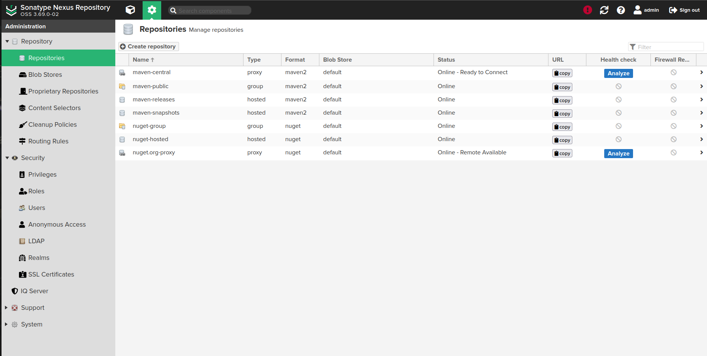

# NEXUS & MAVEN

### Advertisements

> NOTE: Java 1.8+ is required, it is possible to install the java JVM with the following command:
> sudo apt install openjdk-8-jre-headless

> IMPORTANT: The nexus server IP must be static when it was used in the production environment or when
> it will be used for a development team

> NOTE: This documentation was made when the Nexus Version is 3.69.0-02 and Maven Version chosen is 3.6.3

### Nexus Installing for Ubuntu

- Get the nexus package

<pre>
cd /home/$USER
sudo apt update
sudo apt install openjdk-8-jre-headless
wget https://download.sonatype.com/nexus/3/latest-unix.tar.gz
</pre>

- Add a nexus user system

<pre>
sudo adduser --no-create-home --disabled-password --disabled-login nexus
Adding user `nexus' ...
Adding new group `nexus' (1001) ...
Adding new user `nexus' (1001) with group `nexus' ...
Not creating home directory `/home/nexus'.
Changing the user information for nexus
Enter the new value, or press ENTER for the default
	Full Name []: 
	Room Number []: 
	Work Phone []: 
	Home Phone []: 
	Other []: 
Is the information correct? [Y/n] Y
</pre>

- Extract the nexus file downloaded

<pre>
tar -xvf latest-unix.tar.gz
</pre>

- Move the extracted folder from nexus file into /opt/ directory

<pre>
sudo mv nexus-3.69.0-02 sonatype-work /opt/
cd /opt/
ls -ltr
total 8
drwxrwxr-x 10 almalinux-vbox almalinux-vbox 4096 jun 21 16:40 nexus-3.69.0-02
drwxrwxr-x  3 almalinux-vbox almalinux-vbox 4096 jun 21 16:40 sonatype-work
</pre>

- Allow permissions for the nexus user

<pre>
sudo chown -R nexus:nexus /opt/nexus-3.69.0-02
sudo chown -R nexus:nexus /opt/sonatype-work
</pre>

- Edit the Nexus RC file with the user nexus (it mean that the nexus service will be running by nexus user)

<pre>
sudo vi /opt/nexus-3.69.0-02/bin/nexus.rc

FILE
================================================
run_as_user="nexus"
================================================
</pre>

- Create the Nexus service system (Be careful with the nexus version)

<pre>
sudo vi /etc/systemd/system/nexus.service

FILE
================================================
[Unit]
Description=nexus service
After=network.target

[Service]
Type=forking
LimitNOFILE=65536
ExecStart=/opt/nexus-3.69.0-02/bin/nexus start
ExecStop=/opt/nexus-3.69.0-02/bin/nexus stop
User=nexus
Restart=on-abort
TimeoutSec=600

[Install]
WantedBy=multi-user.target
================================================
</pre>

- Start and manager the nexus service

<pre>
sudo systemctl daemon-reload
sudo systemctl status nexus.service 
    ● nexus.service - nexus service
         Loaded: loaded (/etc/systemd/system/nexus.service; disabled; vendor preset: enabled)
         Active: inactive (dead)
sudo systemctl start nexus.service 
sudo systemctl status nexus.service 
    ● nexus.service - nexus service
         Loaded: loaded (/etc/systemd/system/nexus.service; disabled; vendor preset: enabled)
         Active: active (running) since Fri 2024-06-21 17:01:32 -03; 5s ago
        Process: 9374 ExecStart=/opt/nexus-3.69.0-02/bin/nexus start (code=exited, status=0/SUCCESS)
       Main PID: 9579 (java)
          Tasks: 26 (limit: 2205)
         Memory: 230.3M
         CGroup: /system.slice/nexus.service
                 └─9579 /usr/lib/jvm/java-8-openjdk-amd64/jre/bin/java -server -Dinstall4j.jvmDir=/usr/lib/jvm/java-8-openjdk-amd64/jre -Dexe4j>
    
    jun 21 17:01:31 ubuntuv-box systemd[1]: Starting nexus service...
    jun 21 17:01:32 ubuntuv-box nexus[9374]: Starting nexus
    jun 21 17:01:32 ubuntuv-box systemd[1]: Started nexus service.
</pre>

- Access the Nexus Application (in the web browser)

<pre>
http://${IP-NEXUS}:8081/
</pre>

- Change the admin password

<pre>
cat /opt/sonatype-work/nexus3/admin.password
</pre>

- Define new password and public or private access (it is very recommended to set the private access: using authentication)

###### Maven Installing

- Get the Maven packages

<pre>
cd /opt
wget https://archive.apache.org/dist/maven/maven-3/3.6.3/binaries/apache-maven-3.6.3-bin.tar.gz
tar -xvf apache-maven-3.6.3-bin.tar.gz
mv apache-maven-3.6.3 maven
rm apache-maven-3.6.3-bin.tar.gz
</pre>

- Set maven variables

<pre>
sudo vi /etc/profile.d/mavensh.sh
</pre>

<pre>
export JAVA_HOME=/usr/share/jdk1.8.0_212
export M2_HOME=/opt/maven
export PATH=${M2_HOME}/bin:$PATH
</pre>

<pre>
sudo chmod +x /etc/profile.d/mavensh.sh
source /etc/profile.d/mavensh.sh
</pre>

- Check Maven Version

<pre>
mvn --version
</pre>

> NOTE: In case there is an error in the mvn execution (according example below), try to fix it installing
> the OPENJDK and change the java binary for that last one instead using JRE.

> IMPORTANT: Maven required JDK instead JRE and Nexus don't

<pre>
The JAVA_HOME environment variable is not defined correctly
This environment variable is needed to run this program
NB: JAVA_HOME should point to a JDK not a JRE
</pre>

- Mvn Deploy (Initial Sample)

<pre>
mvn deploy
[INFO] Scanning for projects...
[INFO] ------------------------------------------------------------------------
[INFO] BUILD FAILURE
[INFO] ------------------------------------------------------------------------
[INFO] Total time:  0.148 s
[INFO] Finished at: 2024-06-21T21:47:11-03:00
[INFO] ------------------------------------------------------------------------
[ERROR] The goal you specified requires a project to execute but there is no POM in this directory (/opt). Please verify you invoked Maven from the correct directory. -> [Help 1]
[ERROR] 
[ERROR] To see the full stack trace of the errors, re-run Maven with the -e switch.
[ERROR] Re-run Maven using the -X switch to enable full debug logging.
[ERROR] 
[ERROR] For more information about the errors and possible solutions, please read the following articles:
[ERROR] [Help 1] http://cwiki.apache.org/confluence/display/MAVEN/MissingProjectException
</pre>

The command above will probably result in one error because we have not made the correct settings, so lets towards. 

- Mvn Settings (repository type: proxy)

Create the settings xml file in the m2 folder placed in the root path for the current user:

<pre>
cd ~/.m2
sudo vi settings.xml
</pre>

Put the xml code below in the settings.xml file created previously

<code>

    <settings xmlns="http://maven.apache.org/SETTINGS/1.0.0"
                xmlns:xsi="http://www.w3.org/2001/XMLSchema-instance"
                xsi:schemaLocation="http://maven.apache.org/SETTINGS/1.0.0
                http://maven.apache.org/xsd/settings-1.0.0.xsd">
        <servers>
            <server>
                <id>nexus</id>
                <username>admin</username>
                <password>123mudar</password>
            </server>
        </servers>
        <mirrors>
            <mirror>
                <id>nexus</id>
                <name>central</name>
                <url>http://localhost:8081/repository/maven-proxy-test</url>
                <mirrorOf>*</mirrorOf>
            </mirror>
        </mirrors>
        <profiles>
            <profile>
                <id>nexus</id>
                <repositories>
                    <repository>
                        <id>spring-milestones</id>
                        <name>Spring Milestones</name>
                        <url>https://repo.spring.io/milestone</url>
                        <snapshots>
                        <enabled>false</enabled>
                        </snapshots>
                    </repository>
                    <repository>
                        <id>spring-snapshots</id>
                        <name>Spring Snapshots</name>
                        <url>https://repo.spring.io/snapshot</url>
                        <releases>
                        <enabled>false</enabled>
                        </releases>
                    </repository>
                    <repository>
                        <id>maven_central</id>
                        <url>https://repo1.maven.org/maven2/</url>
                        </repository>
                        <repository>
                        <id>nexus</id>
                        <url>http://localhost:8081/repository/maven-proxy-test/</url>
                    </repository>
                </repositories>
                <pluginRepositories>
                    <pluginRepository>
                        <id>central</id>
                        <url>http://central</url>
                        <releases><enabled>true</enabled></releases>
                        <snapshots><enabled>true</enabled></snapshots>
                    </pluginRepository>
                </pluginRepositories>
            </profile>
        </profiles>
        <activeProfiles>
            <activeProfile>nexus</activeProfile>
        </activeProfiles>
    </settings>

</code>

*** Now jump to Maven Project Samples ***

### Nexus Installing for AlmaLinux

> NOTE: The current Almalinux version is 8.10

- Prepare environment

<pre>
cd /home/$USER
sudo yum update
sudo dnf update
sudo dnf install java-1.8.0-openjdk
sudo dnf install wget
sudo dnf install tar
</pre>

<pre>
export JAVA_HOME=/usr/bin
export INSTALL4J_JAVA_HOME_OVERRIDE=/usr/lib/jvm/jre-openjdk
export PATH=$JAVA_HOME:$PATH

source /etc/profile

echo $JAVA_HOME
echo $INSTALL4J_JAVA_HOME_OVERRIDE
echo $PATH
</pre>

- Get the nexus package

<pre>
wget https://download.sonatype.com/nexus/3/latest-unix.tar.gz
</pre>

- Extract the nexus file downloaded

<pre>
tar -xvf latest-unix.tar.gz
</pre>

- Add a nexus user system

<pre>
#sudo adduser --no-create-home --system nexus
sudo adduser nexus
</pre>

- Move the extracted folder from nexus file into /opt/ directory

<pre>
sudo mv nexus-3.69.0-02 sonatype-work /opt/
cd /opt/
ls -ltr
</pre>

<pre>
total 8
drwxrwxr-x 10 almalinux-vbox almalinux-vbox 4096 jun 21 16:40 nexus-3.69.0-02
drwxrwxr-x  3 almalinux-vbox almalinux-vbox 4096 jun 21 16:40 sonatype-work
</pre>

- Allow permissions for the nexus user

<pre>
sudo chown -R nexus:nexus /opt/nexus-3.69.0-02
sudo chown -R nexus:nexus /opt/sonatype-work
ls -ltr
</pre>

<pre>
total 0
drwxrwxr-x. 10 nexus nexus 181 Jun 23 09:35 nexus-3.69.0-02
drwxrwxr-x.  3 nexus nexus  20 Jun 23 09:36 sonatype-work
</pre>

- Edit the Nexus RC file with the user nexus

> It means that the nexus service will be running by nexus user

<pre>
sudo vi /opt/nexus-3.69.0-02/bin/nexus.rc
</pre>

<pre>
run_as_user="nexus"
</pre>

- Remove the old nexus PID file 

> Be sure that this file doesn't exist

<pre>
sudo rm -rf /tmp/i4jdaemon__opt_nexus-3.69.0-02_bin_nexus
</pre>

- Create the Nexus service system 

> Be careful with the nexus version

<pre>
sudo vi /etc/systemd/system/nexus.service
</pre>

<pre>
[Unit]
Description=nexus service
After=network.target

[Service]
Type=forking
LimitNOFILE=65536
ExecStart=/opt/nexus-3.69.0-02/bin/nexus start
ExecStop=/opt/nexus-3.69.0-02/bin/nexus stop
User=nexus
Group=nexus
Restart=on-abort
TimeoutSec=600

[Install]
WantedBy=multi-user.target
</pre>

<pre>
sudo systemctl daemon-reload
sudo systemctl enable nexus.service
</pre>

- Activate nexus in the SELinux

<pre>
sudo ln -s /opt/nexus-3.69.0-02/bin/nexus /etc/init.d/nexus
cd /etc/init.d
sudo chkconfig --add nexus
sudo chkconfig --levels 345 nexus on
</pre>

- Allow nexus user to ensure that the service will be ok

<pre>
sudo chcon -R -t bin_t /opt/nexus-3.69.0-02/bin/nexus
sudo chown -R nexus:nexus /etc/init.d/nexus
sudo chown -R nexus:nexus /etc/systemd/system/nexus.service
sudo chown -R nexus:nexus /etc/systemd/system/multi-user.target.wants/nexus.service
</pre>

- Start and manager the nexus service

<pre>
sudo systemctl status nexus.service
</pre>

<pre>
● nexus.service - nexus service
     Loaded: loaded (/etc/systemd/system/nexus.service; disabled; vendor preset: enabled)
     Active: inactive (dead)
</pre>

<pre>
sudo systemctl start nexus.service
sudo systemctl status nexus.service
</pre>

<pre>
● nexus.service - nexus service
     Loaded: loaded (/etc/systemd/system/nexus.service; disabled; vendor preset: enabled)
     Active: active (running) since Fri 2024-06-21 17:01:32 -03; 5s ago
    Process: 9374 ExecStart=/opt/nexus-3.69.0-02/bin/nexus start (code=exited, status=0/SUCCESS)
   Main PID: 9579 (java)
      Tasks: 26 (limit: 2205)
     Memory: 230.3M
     CGroup: /system.slice/nexus.service
             └─9579 /usr/lib/jvm/java-8-openjdk-amd64/jre/bin/java -server -Dinstall4j.jvmDir=/usr/lib/jvm/java-8-openjdk-amd64/jre -Dexe4j>

jun 21 17:01:31 ubuntuv-box systemd[1]: Starting nexus service...
jun 21 17:01:32 ubuntuv-box nexus[9374]: Starting nexus
jun 21 17:01:32 ubuntuv-box systemd[1]: Started nexus service.
</pre>

- Allow firewall

<pre>
sudo firewall-cmd --add-port=8081/tcp --permanent
sudo firewall-cmd --reload
</pre>

> IMPORTANT: To recovery the previous state of the firewall you can execute the following command

<pre>
firewall-cmd --zone=public --remove-port=8081/tcp
firewall-cmd --runtime-to-permanent 
firewall-cmd --reload 
</pre>

- Access the Nexus Application (in the web browser)

<pre>
http://192.168.0.241:8081/
</pre>

- Check log

<pre>
tail -f /opt/sonatype-work/nexus3/log/nexus.log
</pre>

- Change the admin password

<pre>
cat /opt/sonatype-work/nexus3/admin.password
</pre>

Define new password and public or private access (it is very recommended to set the private access: using authentication)

###### Reset changes in the current machine

> WARNING: It will remove and erase all settings and configurations made to install Nexus, so make sure you 
> have backup your files and configurations (THIS PROCESS CAN'T BE UNDO)

Follow exactly all steps below

> NOTE: The command sudo require password, you can create a destroy.sh to automate all process executing
> sudo ./destroy.sh

<pre>
#!/bin/bash

echo "Locking firewall - port 8081"
sudo firewall-cmd --zone=public --remove-port=8081/tcp
sudo firewall-cmd --runtime-to-permanent 
sudo firewall-cmd --reload

sleep 2

echo "Stopping and removing service - nexus.service"
sudo systemctl stop nexus.service
sudo service nexus stop
sudo rm -f /etc/systemd/system/nexus.service
sudo rm -f /etc/systemd/system/multi-user.target.wants/nexus.service
sudo rm -f /etc/init.d/nexus
sudo systemctl daemon-reload

sleep 2

echo "Removing folders"
sudo rm -f /tmp/i4jdaemon__opt_nexus-3.69.0-02_bin_nexus
sudo rm -rf /opt/nexus-3.69.0-02
sudo rm -rf /opt/sonatype-work

sleep 2

echo "Unset variables - JAVA_HOME"
unset JAVA_HOME
unset INSTALL4J_JAVA_HOME_OVERRIDE
source /etc/profile

sleep 2

echo "Removing user - nexus"
sudo userdel nexus
sudo rm -rf /home/nexus
sudo rm -rf /var/spool/mail/nexus
cd /home/almalinux-vbox

sleep 2

echo "DONE"
exit
</pre>

###### Maven Installing

- Get the Maven packages

<pre>
cd /home/almalinux-vbox
wget https://archive.apache.org/dist/maven/maven-3/3.6.3/binaries/apache-maven-3.6.3-bin.tar.gz
tar -xvf apache-maven-3.6.3-bin.tar.gz
sudo mv apache-maven-3.6.3 /opt/maven
cd /opt
</pre>

- Set maven variables

<pre>
sudo vi /etc/profile.d/mavensh.sh
</pre>

<pre>
export JAVA_HOME=/usr/share/jdk1.8.0_212
export M2_HOME=/opt/maven
export PATH=${M2_HOME}/bin:$PATH
</pre>

<pre>
sudo chmod +x /etc/profile.d/mavensh.sh
source /etc/profile.d/mavensh.sh
</pre>

- Check Maven Version

<pre>
mvn --version
</pre>

> NOTE: In case there is an error in the mvn execution (according example below), try to fix it installing
> the OPENJDK and change the java binary for that last one instead using JRE.

> IMPORTANT: Maven required JDK instead JRE and Nexus don't

<pre>
The JAVA_HOME environment variable is not defined correctly
This environment variable is needed to run this program
NB: JAVA_HOME should point to a JDK not a JRE
</pre>

- Fix the maven error

<pre>
scp jdk-8u212-linux-x64.tar.gz almalinux-vbox@192.168.0.241:/home/almalinux-vbox
tar -xvf jdk-8u212-linux-x64.tar.gz
sudo mv jdk1.8.0_212 /usr/share/jdk1.8.0_212
</pre>

- Mvn Deploy (Initial Sample)

<pre>
cd /opt
mvn deploy
[INFO] Scanning for projects...
[INFO] ------------------------------------------------------------------------
[INFO] BUILD FAILURE
[INFO] ------------------------------------------------------------------------
[INFO] Total time:  0.148 s
[INFO] Finished at: 2024-06-21T21:47:11-03:00
[INFO] ------------------------------------------------------------------------
[ERROR] The goal you specified requires a project to execute but there is no POM in this directory (/opt). Please verify you invoked Maven from the correct directory. -> [Help 1]
[ERROR] 
[ERROR] To see the full stack trace of the errors, re-run Maven with the -e switch.
[ERROR] Re-run Maven using the -X switch to enable full debug logging.
[ERROR] 
[ERROR] For more information about the errors and possible solutions, please read the following articles:
[ERROR] [Help 1] http://cwiki.apache.org/confluence/display/MAVEN/MissingProjectException
</pre>

The command above will probably result in one error because we have not made the correct settings, so lets towards.

- Mvn Settings (repository type: proxy)

Create the settings xml file in the m2 folder placed in the root path for the current user:

<pre>
cd ~/.m2
sudo vi settings.xml
</pre>

Put the xml code below in the settings.xml file created previously

<code>

    <settings xmlns="http://maven.apache.org/SETTINGS/1.0.0"
                xmlns:xsi="http://www.w3.org/2001/XMLSchema-instance"
                xsi:schemaLocation="http://maven.apache.org/SETTINGS/1.0.0
                http://maven.apache.org/xsd/settings-1.0.0.xsd">
        <servers>
            <server>
                <id>nexus</id>
                <username>admin</username>
                <password>123mudar</password>
            </server>
        </servers>
        <mirrors>
            <mirror>
                <id>nexus</id>
                <name>central</name>
                <url>http://localhost:8081/repository/maven-proxy-test</url>
                <mirrorOf>*</mirrorOf>
            </mirror>
        </mirrors>
        <profiles>
            <profile>
                <id>nexus</id>
                <repositories>
                    <repository>
                        <id>spring-milestones</id>
                        <name>Spring Milestones</name>
                        <url>https://repo.spring.io/milestone</url>
                        <snapshots>
                        <enabled>false</enabled>
                        </snapshots>
                    </repository>
                    <repository>
                        <id>spring-snapshots</id>
                        <name>Spring Snapshots</name>
                        <url>https://repo.spring.io/snapshot</url>
                        <releases>
                        <enabled>false</enabled>
                        </releases>
                    </repository>
                    <repository>
                        <id>maven_central</id>
                        <url>https://repo1.maven.org/maven2/</url>
                        </repository>
                        <repository>
                        <id>nexus</id>
                        <url>http://localhost:8081/repository/maven-proxy-test/</url>
                    </repository>
                </repositories>
                <pluginRepositories>
                    <pluginRepository>
                        <id>central</id>
                        <url>http://central</url>
                        <releases><enabled>true</enabled></releases>
                        <snapshots><enabled>true</enabled></snapshots>
                    </pluginRepository>
                </pluginRepositories>
            </profile>
        </profiles>
        <activeProfiles>
            <activeProfile>nexus</activeProfile>
        </activeProfiles>
    </settings>

</code>

*** Now jump to Maven Project Samples ***

### Repository Information

- Repository Types: [group, hosted, proxy]
    - group: to create a group of repositories, you can choose witch repositories will be used in it
    - hosted: in this case the repositories hosted in it will be private and only authorized people will be able to use it
      and also each package will be put in the snapshots and releases repository inside Nexus
    - proxy: to use with external repositories, in this case the packages downloaded will be placed in the nexus local
      repository and in the next times that the package will request it will be got in the local repository.

### Maven Project Samples

- Create the repository in the Nexus

<pre>
http://${IP-NEXUS}:8081/#admin/repository
    > Configurations 
        > Repositories > Create repository 
            > maven2 (proxy)
                > Give a name to repostirory
                > Enter the remote storage to download repositories packages
                > Click Create repository
</pre>

- Create one sample maven project - proxy

<pre>
cd /opt
mkdir -p projects/proxy-test
cd projects/proxy-test
</pre>

<pre>vi pom.xml</pre>

<code>

    <project>
        <modelVersion>4.0.0</modelVersion>
        <groupId>com.sample</groupId>
        <artifactId>nexus-proxy</artifactId>
        <version>1.0.0-SNAPSHOT</version>
        <dependencies>
            <dependency>
                <groupId>junit</groupId>
                <artifactId>junit</artifactId>
                <version>4.10</version>
            </dependency>
        </dependencies>
    </project>

</code>

- Execute mvn package in the project folder

<pre>
mvn package
</pre>

- Check the Nexus Interface
<pre>
http://${IP-NEXUS}:8081/#browse/browse:maven-proxy-test
</pre>

- Create one sample maven project - hosted

<pre>
cd /opt
mkdir -p projects/hosted-test
cd projects/hosted-test
</pre>

<pre>vi pom.xml</pre>

<code>

    <project>
        <modelVersion>4.0.0</modelVersion>
        <groupId>com.sample</groupId>
        <artifactId>nexus-proxy</artifactId>
        <version>1.0.0-SNAPSHOT</version>
        <dependencies>
            <dependency>
                <groupId>junit</groupId>
                <artifactId>junit</artifactId>
                <version>4.10</version>
            </dependency>
        </dependencies>
        <distributionManagement>
            <repository>
                <id>nexus</id>
                <name>maven-releases</name>
                <url>http://localhost:8081/repository/maven-releases/</url>
            </repository>
            <snapshotRepository>
                <id>nexus</id>
                <name>maven-snapshots</name>
                <url>http://localhost:8081/repository/maven-snapshots/</url>
            </snapshotRepository>
        </distributionManagement>
    </project>

</code>

- Execute mvn command to deploy hosted project

<pre>
mvn clean deploy
</pre>

- Check the Nexus Interface
<pre>
http://${IP-NEXUS}:8081/#browse/browse:maven-releases
http://${IP-NEXUS}:8081/#browse/browse:maven-snapshots
</pre>

- Create one sample maven project - group

<pre>
cd ~/.m2
sudo vi settings.xml
</pre>

<code>

    <settings xmlns="http://maven.apache.org/SETTINGS/1.0.0"
                xmlns:xsi="http://www.w3.org/2001/XMLSchema-instance"
                xsi:schemaLocation="http://maven.apache.org/SETTINGS/1.0.0
                http://maven.apache.org/xsd/settings-1.0.0.xsd">
        <servers>
            <server>
                <id>nexus</id>
                <username>admin</username>
                <password>123mudar</password>
            </server>
        </servers>
        <mirrors>
            <mirror>
                <id>nexus</id>
                <name>central</name>
                <url>http://localhost:8081/repository/maven-group-test</url>
                <mirrorOf>*</mirrorOf>
            </mirror>
        </mirrors>
        <profiles>
            <profile>
                <id>nexus</id>
                <repositories>
                    <repository>
                        <id>spring-milestones</id>
                        <name>Spring Milestones</name>
                        <url>https://repo.spring.io/milestone</url>
                        <snapshots>
                        <enabled>false</enabled>
                        </snapshots>
                    </repository>
                    <repository>
                        <id>spring-snapshots</id>
                        <name>Spring Snapshots</name>
                        <url>https://repo.spring.io/snapshot</url>
                        <releases>
                        <enabled>false</enabled>
                        </releases>
                    </repository>
                    <repository>
                        <id>maven_central</id>
                        <url>https://repo1.maven.org/maven2/</url>
                        </repository>
                        <repository>
                        <id>nexus</id>
                        <url>http://localhost:8081/repository/maven-group-test/</url>
                    </repository>
                </repositories>
                <pluginRepositories>
                    <pluginRepository>
                        <id>central</id>
                        <url>http://central</url>
                        <releases><enabled>true</enabled></releases>
                        <snapshots><enabled>true</enabled></snapshots>
                    </pluginRepository>
                </pluginRepositories>
            </profile>
        </profiles>
        <activeProfiles>
            <activeProfile>nexus</activeProfile>
        </activeProfiles>
    </settings>

</code>

- Create the repository in the Nexus

<pre>
http://${IP-NEXUS}:8081/#admin/repository
    > Configurations 
        > Repositories > Create repository 
            > maven2 (group)
                > Give a name to repostirory
                > Choose the repository Members
                > Click Create repository
</pre>

<pre>
cd /opt
mkdir -p projects/group-test
cd projects/group-test
</pre>

<pre>vi pom.xml</pre>

<code>

    <project>
        <modelVersion>4.0.0</modelVersion>
        <groupId>com.sample</groupId>
        <artifactId>nexus-proxy</artifactId>
        <version>1.0.0-SNAPSHOT</version>
        <dependencies>
            <dependency>
                <groupId>junit</groupId>
                <artifactId>junit</artifactId>
                <version>4.10</version>
            </dependency>
        </dependencies>
        <distributionManagement>
            <repository>
                <id>nexus</id>
                <name>maven-releases</name>
                <url>http://localhost:8081/repository/maven-releases/</url>
            </repository>
            <snapshotRepository>
                <id>nexus</id>
                <name>maven-snapshots</name>
                <url>http://localhost:8081/repository/maven-snapshots/</url>
            </snapshotRepository>
        </distributionManagement>
    </project>

</code>

- Execute mvn command in the project folder

<pre>
mvn clean install
</pre>

- Check the Nexus Interface
<pre>
http://${IP-NEXUS}:8081/#browse/browse:maven-group-test
</pre>